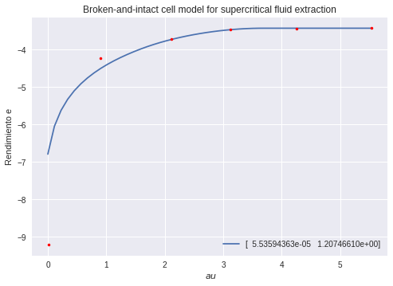
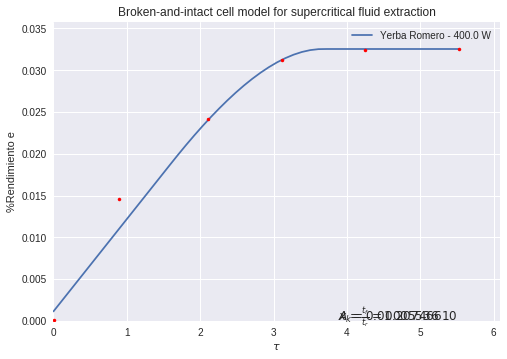
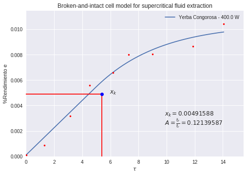
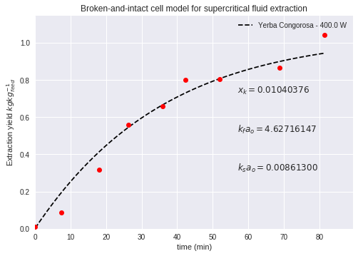
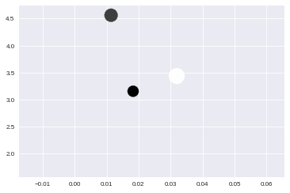

.. code:: ipython3

    import numpy as np
    import pandas as pd
    
    from scipy import *
    from scipy import optimize
    from scipy.optimize import root
    from scipy import integrate, interpolate
    from scipy.optimize import least_squares
    
    import re
    import glob, os.path
    
    import matplotlib.pyplot as plt
    import pylab as pp
    %matplotlib inline
    #plt.style.available
    plt.style.use("seaborn")
    #plt.style.use("seaborn-deep")
    #plt.style.use("seaborn-paper")
     
    from ipywidgets import widgets
    from IPython.display import display
    from ipywidgets import *
    import matplotlib.pyplot as plt
    import ipywidgets as wdg
    from IPython.display import clear_output

Preprocesamiento de los datos
=============================

.. code:: ipython3

    directorios = glob.glob("Datos Yerbas/*")
    rutasArchivos = [directorio+"/*.csv" for directorio in directorios]
    nombresArchivos = [glob.glob(ruta) for ruta in rutasArchivos]
    _ = [nombresArchivos[i].sort() for i in range(0, len(nombresArchivos))]
    
    nombreRegex = re.compile(r'[a-z]+_+[0-9]+W', re.IGNORECASE)
    
    def nombreYerba(ruta, nombreRegex):
        yerbaEnsayo = nombreRegex.search(ruta)
        
        if yerbaEnsayo:
            #print('Nombre de archivo encontrado: ' + yerbaEnsayo.group())
            return yerbaEnsayo.group()
        else:
            print('No se encontró un nombre de archivo')
            return 'No se encontró un nombre de archivo'
            
    nombreYerba(nombresArchivos[1][0],nombreRegex)
    
    nombre_XW = [[nombreYerba(nombresArchivos[j][i],nombreRegex) for i in range(0, len(nombresArchivos[j]))] for j in range(0, len(nombresArchivos))]
    
    #nombre_XW =  nombre_XW.sort()
    
    print(nombre_XW)
    Yerba_XW = [[pd.read_csv(nombresArchivos[j][i], sep=" ", index_col=False) for i in range(0, len(nombresArchivos[j]))] for j in range(0, len(nombresArchivos))]
    print(Yerba_XW)
    
    #DatosBoldo = Yerba_XW[:][0]
    #DatosBrasil = Yerba_XW[:][1]
    #DatosCongorosa = Yerba_XW[:][2]
    #DatosRomero = Yerba_XW[:][3]
    #DatosUruguay = Yerba_XW[:][4]
    
    DatosBoldo = Yerba_XW[:][0]
    DatosBrasil = Yerba_XW[:][1]
    DatosCongorosa = Yerba_XW[:][4]
    DatosRomero = Yerba_XW[:][3]
    DatosUruguay = Yerba_XW[:][2]
    
    
    for i in range(0, len(Yerba_XW[:][0])):
        DatosBoldo[i]["minutos"]
    
    for i in range(0, len(Yerba_XW[:][1])):
        DatosBrasil[i]["minutos"]
        
    #print(DatosCongorosa[0])
    
    tablaCongorosa = np.append(DatosCongorosa[0]["minutos"],
                               [DatosCongorosa[1]["minutos"],
                                DatosCongorosa[2]["minutos"],
                                DatosCongorosa[3]["minutos"]])
    
    tablaCongorosa
    
    #DC = pd.DataFrame(data=DatosCongorosa)
    #DC
    
    #DC = pd.DataFrame()
    
    DB = pd.concat([DatosBoldo[0], DatosBoldo[1], DatosBoldo[2], DatosBoldo[3], DatosBoldo[4]], axis=1)
    DB
    
    DBr = pd.concat([DatosBrasil[0], DatosBrasil[1], DatosBrasil[2], DatosBrasil[3], DatosBrasil[3]*NaN], axis=1)
    DBr
    
    DC = pd.concat([DatosCongorosa[0], DatosCongorosa[1], DatosCongorosa[2], DatosCongorosa[3], DatosCongorosa[3]*NaN], axis=1)
    DC
    
    DUr = pd.concat([DatosUruguay[0], DatosUruguay[1], DatosUruguay[2], DatosUruguay[3],
                     DatosUruguay[4]], axis=1)
    DUr
    
    DR = pd.concat([DatosRomero[0], DatosRomero[1], DatosRomero[2], DatosRomero[3], DatosRomero[3]*NaN], axis=1)
    DR
    
    label_0 = ["Boldo"] * max(len(DatosBoldo[0]), len(DatosBoldo[1]), len(DatosBoldo[2]),
                              len(DatosBoldo[3]), len(DatosBoldo[4]))
    len(label_0)
    
    label_1 = ["Brasil"] * max(len(DatosBrasil[0]), len(DatosBrasil[1]), len(DatosBrasil[2]),
                              len(DatosBrasil[3]), len(DatosBrasil[3]))
    len(label_1)
    
    label_2 = ["Congorosa"] * max(len(DatosCongorosa[0]), len(DatosCongorosa[1]), len(DatosCongorosa[2]),
                                  len(DatosCongorosa[3]))
    len(label_2)
    
    DC["matriz"] = label_2
    #DC = DC.set_index(["matriz"])
    DC
    
    DUr

.. parsed-literal::

    [['Boldo_0W', 'Boldo_160W', 'Boldo_200W', 'Boldo_280W', 'Boldo_400W'], ['Brasil_0W', 'Brasil_200W', 'Brasil_280W', 'Brasil_400W'], ['Uruguay_0W', 'Uruguay_200W', 'Uruguay_280W', 'Uruguay_400W', 'Uruguay_600W'], ['Romero_0W', 'Romero_200W', 'Romero_280W', 'Romero_400W'], ['Congorosa_0W', 'Congorosa_200W', 'Congorosa_280W', 'Congorosa_400W']]
    [[   minutos  rendimiento
    0    0.000       0.0000
    1    6.683       0.9460
    2    6.953       1.1193
    3   17.053       2.3520
    4   25.069       2.8202
    5   34.586       3.2030
    6   41.586       3.3810
    7   52.353       3.5706
    8   69.019       3.7933
    9   84.019       3.6280,    minutos  rendimiento
    0    0.000        0.000
    1    7.250        1.127
    2   20.117        2.557
    3   25.200        2.835
    4   35.917        3.113
    5   43.033        3.272
    6   53.333        3.406
    7   72.950        3.591
    8   88.100        3.686,    minutos  rendimiento
    0    0.000        0.000
    1    6.850        1.095
    2   17.250        2.350
    3   25.333        2.872
    4   34.750        3.228
    5   41.400        3.383
    6   58.317        3.555,    minutos  rendimiento
    0    0.000        0.000
    1    7.383        1.093
    2   18.333        2.339
    3   25.333        2.861
    4   37.750        3.157
    5   43.883        3.301
    6   55.750        3.700
    7   68.150        3.700
    8   82.750        3.821,    minutos  rendimiento
    0    0.000        0.000
    1    6.833        1.013
    2   18.250        2.206
    3   25.483        2.656
    4   34.900        2.991
    5   41.533        3.433
    6   53.183        3.650
    7   68.150        3.829
    8   82.750        3.934], [   minutos  rendimiento
    0     0.00       0.0000
    1     3.00       0.0508
    2    17.58       0.4874
    3    25.00       0.7331
    4    35.23       1.0231
    5    40.65       1.1210
    6    50.37       1.1710
    7    70.28       1.2448
    8    96.00       1.3626,    minutos  rendimiento
    0     0.00        0.000
    1     5.00        0.100
    2    16.45        0.761
    3    25.27        1.073
    4    35.53        1.317
    5    42.28        1.438
    6    55.08        1.532
    7    72.85        1.643
    8    87.20        1.766,     minutos  rendimiento
    0     0.000        0.000
    1     6.733        0.270
    2    16.450        0.761
    3    17.400        0.846
    4    25.270        1.073
    5    26.000        1.126
    6    35.530        1.317
    7    37.067        1.365
    8    42.280        1.438
    9    45.300        1.522
    10   55.080        1.532
    11   58.750        1.697
    12   77.000        1.760
    13   87.200        1.766,    minutos  rendimiento
    0    0.000        0.000
    1    6.900        0.174
    2   17.367        0.622
    3   26.050        0.797
    4   38.500        1.006
    5   45.900        1.062
    6   58.683        1.184
    7   77.517        1.354
    8   90.183        1.493], [    minutos  rendimiento
    0     0.000        0.000
    1     6.667        0.200
    2     7.550        0.283
    3    17.117        0.750
    4    25.583        0.977
    5    35.000        1.146
    6    41.667        1.231
    7    52.450        1.335
    8    59.000        1.365
    9    79.333        1.450
    10   96.733        1.344,    minutos  rendimiento
    0    0.000        0.000
    1    6.967        0.095
    2   17.750        0.234
    3   26.150        0.298
    4   36.667        0.345
    5   44.667        0.384
    6   53.083        0.416
    7   74.867        0.451
    8   84.917        0.506,    minutos  rendimiento
    0    0.000        0.000
    1    7.417        0.078
    2   17.750        0.226
    3   25.717        0.294
    4   37.033        0.365
    5   44.567        0.395
    6   55.667        0.426
    7   73.250        0.480
    8   86.667        0.540,    minutos  rendimiento
    0    0.000        0.000
    1    7.583        0.074
    2   19.417        0.221
    3   28.167        0.357
    4   37.917        0.432
    5   44.200        0.462
    6   54.883        0.498
    7   70.233        0.556
    8   81.850        0.579,    minutos  rendimiento
    0    0.000        0.000
    1    7.000        0.092
    2   17.500        0.221
    3   25.100        0.381
    4   38.450        0.469
    5   46.450        0.520
    6   57.167        0.564
    7   70.100        0.618], [   minutos  rendimiento
    0    0.000        0.000
    1    7.283        1.031
    2   17.333        2.284
    3   24.750        2.790
    4   34.117        3.215
    5   40.817        3.379
    6   56.705        3.621
    7   73.972        3.767
    8   84.972        3.833,    minutos  rendimiento
    0    0.000        0.000
    1    6.683        1.456
    2   15.767        2.491
    3   23.083        2.916
    4   32.150        3.300
    5   38.667        3.350
    6   48.250        3.438
    7   64.533        3.553
    8   79.917        3.719,    minutos  rendimiento
    0    0.000        0.000
    1    7.333        1.399
    2   21.083        2.378
    3   28.483        2.976
    4   38.317        3.619
    5   45.117        3.750
    6   55.650        3.908
    7   70.867        4.124
    8   84.867        4.292,    minutos  rendimiento
    0    0.000        0.000
    1    7.400        1.461
    2   17.467        2.412
    3   25.800        3.128
    4   35.200        3.239
    5   45.800        3.254], [   minutos  rendimiento
    0     0.00       0.0000
    1     5.00       0.0080
    2     6.83       0.0250
    3    16.27       0.2689
    4    24.33       0.3520
    5    33.80       0.4290
    6    39.45       0.4292
    7    50.47       0.4336
    8    64.15       0.5580
    9    79.05       0.6090,     minutos  rendimiento
    0     0.000        0.000
    1     5.000        0.119
    2     6.917        0.154
    3     7.480        0.230
    4    16.983        0.634
    5    18.120        0.638
    6    25.833        0.879
    7    27.030        0.788
    8    33.983        0.948
    9    37.330        0.908
    10   44.580        0.957
    11   49.783        1.012
    12   51.067        1.092
    13   55.700        1.023
    14   69.667        1.155
    15   74.830        1.182
    16   87.100        1.317
    17   91.233        1.281,      minutos  rendimiento
    0   0.000000        0.000
    1   6.470000        0.140
    2  15.720000        0.498
    3  22.580000        0.638
    4  31.870000        0.712
    5  38.830000        0.721
    6  49.220000        0.721
    7  65.000000        0.756
    8  79.816667        0.884,    minutos  rendimiento
    0     0.00        0.000
    1     7.47        0.089
    2    18.10        0.319
    3    26.27        0.559
    4    35.83        0.659
    5    42.25        0.800
    6    52.00        0.803
    7    68.73        0.864
    8    81.43        1.042]]

.. raw:: html

    

    
    <table border="1" class="dataframe">
      <thead>
        <tr style="text-align: right;">
          <th></th>
          <th>minutos</th>
          <th>rendimiento</th>
          <th>minutos</th>
          <th>rendimiento</th>
          <th>minutos</th>
          <th>rendimiento</th>
          <th>minutos</th>
          <th>rendimiento</th>
          <th>minutos</th>
          <th>rendimiento</th>
        </tr>
      </thead>
      <tbody>
        <tr>
          <th>0</th>
          <td>0.000</td>
          <td>0.000</td>
          <td>0.000</td>
          <td>0.000</td>
          <td>0.000</td>
          <td>0.000</td>
          <td>0.000</td>
          <td>0.000</td>
          <td>0.000</td>
          <td>0.000</td>
        </tr>
        <tr>
          <th>1</th>
          <td>6.667</td>
          <td>0.200</td>
          <td>6.967</td>
          <td>0.095</td>
          <td>7.417</td>
          <td>0.078</td>
          <td>7.583</td>
          <td>0.074</td>
          <td>7.000</td>
          <td>0.092</td>
        </tr>
        <tr>
          <th>2</th>
          <td>7.550</td>
          <td>0.283</td>
          <td>17.750</td>
          <td>0.234</td>
          <td>17.750</td>
          <td>0.226</td>
          <td>19.417</td>
          <td>0.221</td>
          <td>17.500</td>
          <td>0.221</td>
        </tr>
        <tr>
          <th>3</th>
          <td>17.117</td>
          <td>0.750</td>
          <td>26.150</td>
          <td>0.298</td>
          <td>25.717</td>
          <td>0.294</td>
          <td>28.167</td>
          <td>0.357</td>
          <td>25.100</td>
          <td>0.381</td>
        </tr>
        <tr>
          <th>4</th>
          <td>25.583</td>
          <td>0.977</td>
          <td>36.667</td>
          <td>0.345</td>
          <td>37.033</td>
          <td>0.365</td>
          <td>37.917</td>
          <td>0.432</td>
          <td>38.450</td>
          <td>0.469</td>
        </tr>
        <tr>
          <th>5</th>
          <td>35.000</td>
          <td>1.146</td>
          <td>44.667</td>
          <td>0.384</td>
          <td>44.567</td>
          <td>0.395</td>
          <td>44.200</td>
          <td>0.462</td>
          <td>46.450</td>
          <td>0.520</td>
        </tr>
        <tr>
          <th>6</th>
          <td>41.667</td>
          <td>1.231</td>
          <td>53.083</td>
          <td>0.416</td>
          <td>55.667</td>
          <td>0.426</td>
          <td>54.883</td>
          <td>0.498</td>
          <td>57.167</td>
          <td>0.564</td>
        </tr>
        <tr>
          <th>7</th>
          <td>52.450</td>
          <td>1.335</td>
          <td>74.867</td>
          <td>0.451</td>
          <td>73.250</td>
          <td>0.480</td>
          <td>70.233</td>
          <td>0.556</td>
          <td>70.100</td>
          <td>0.618</td>
        </tr>
        <tr>
          <th>8</th>
          <td>59.000</td>
          <td>1.365</td>
          <td>84.917</td>
          <td>0.506</td>
          <td>86.667</td>
          <td>0.540</td>
          <td>81.850</td>
          <td>0.579</td>
          <td>NaN</td>
          <td>NaN</td>
        </tr>
        <tr>
          <th>9</th>
          <td>79.333</td>
          <td>1.450</td>
          <td>NaN</td>
          <td>NaN</td>
          <td>NaN</td>
          <td>NaN</td>
          <td>NaN</td>
          <td>NaN</td>
          <td>NaN</td>
          <td>NaN</td>
        </tr>
        <tr>
          <th>10</th>
          <td>96.733</td>
          <td>1.344</td>
          <td>NaN</td>
          <td>NaN</td>
          <td>NaN</td>
          <td>NaN</td>
          <td>NaN</td>
          <td>NaN</td>
          <td>NaN</td>
          <td>NaN</td>
        </tr>
      </tbody>
    </table>
    

.. code:: ipython3

    DB["matriz"] = label_0
    #DB = DB.set_index(["matriz"])
    DB

.. raw:: html

    

    
    <table border="1" class="dataframe">
      <thead>
        <tr style="text-align: right;">
          <th></th>
          <th>minutos</th>
          <th>rendimiento</th>
          <th>minutos</th>
          <th>rendimiento</th>
          <th>minutos</th>
          <th>rendimiento</th>
          <th>minutos</th>
          <th>rendimiento</th>
          <th>minutos</th>
          <th>rendimiento</th>
          <th>matriz</th>
        </tr>
      </thead>
      <tbody>
        <tr>
          <th>0</th>
          <td>0.000</td>
          <td>0.0000</td>
          <td>0.000</td>
          <td>0.000</td>
          <td>0.000</td>
          <td>0.000</td>
          <td>0.000</td>
          <td>0.000</td>
          <td>0.000</td>
          <td>0.000</td>
          <td>Boldo</td>
        </tr>
        <tr>
          <th>1</th>
          <td>6.683</td>
          <td>0.9460</td>
          <td>7.250</td>
          <td>1.127</td>
          <td>6.850</td>
          <td>1.095</td>
          <td>7.383</td>
          <td>1.093</td>
          <td>6.833</td>
          <td>1.013</td>
          <td>Boldo</td>
        </tr>
        <tr>
          <th>2</th>
          <td>6.953</td>
          <td>1.1193</td>
          <td>20.117</td>
          <td>2.557</td>
          <td>17.250</td>
          <td>2.350</td>
          <td>18.333</td>
          <td>2.339</td>
          <td>18.250</td>
          <td>2.206</td>
          <td>Boldo</td>
        </tr>
        <tr>
          <th>3</th>
          <td>17.053</td>
          <td>2.3520</td>
          <td>25.200</td>
          <td>2.835</td>
          <td>25.333</td>
          <td>2.872</td>
          <td>25.333</td>
          <td>2.861</td>
          <td>25.483</td>
          <td>2.656</td>
          <td>Boldo</td>
        </tr>
        <tr>
          <th>4</th>
          <td>25.069</td>
          <td>2.8202</td>
          <td>35.917</td>
          <td>3.113</td>
          <td>34.750</td>
          <td>3.228</td>
          <td>37.750</td>
          <td>3.157</td>
          <td>34.900</td>
          <td>2.991</td>
          <td>Boldo</td>
        </tr>
        <tr>
          <th>5</th>
          <td>34.586</td>
          <td>3.2030</td>
          <td>43.033</td>
          <td>3.272</td>
          <td>41.400</td>
          <td>3.383</td>
          <td>43.883</td>
          <td>3.301</td>
          <td>41.533</td>
          <td>3.433</td>
          <td>Boldo</td>
        </tr>
        <tr>
          <th>6</th>
          <td>41.586</td>
          <td>3.3810</td>
          <td>53.333</td>
          <td>3.406</td>
          <td>58.317</td>
          <td>3.555</td>
          <td>55.750</td>
          <td>3.700</td>
          <td>53.183</td>
          <td>3.650</td>
          <td>Boldo</td>
        </tr>
        <tr>
          <th>7</th>
          <td>52.353</td>
          <td>3.5706</td>
          <td>72.950</td>
          <td>3.591</td>
          <td>NaN</td>
          <td>NaN</td>
          <td>68.150</td>
          <td>3.700</td>
          <td>68.150</td>
          <td>3.829</td>
          <td>Boldo</td>
        </tr>
        <tr>
          <th>8</th>
          <td>69.019</td>
          <td>3.7933</td>
          <td>88.100</td>
          <td>3.686</td>
          <td>NaN</td>
          <td>NaN</td>
          <td>82.750</td>
          <td>3.821</td>
          <td>82.750</td>
          <td>3.934</td>
          <td>Boldo</td>
        </tr>
        <tr>
          <th>9</th>
          <td>84.019</td>
          <td>3.6280</td>
          <td>NaN</td>
          <td>NaN</td>
          <td>NaN</td>
          <td>NaN</td>
          <td>NaN</td>
          <td>NaN</td>
          <td>NaN</td>
          <td>NaN</td>
          <td>Boldo</td>
        </tr>
      </tbody>
    </table>
    

.. code:: ipython3

    DBr["matriz"] = label_1
    #DBr = DBr.set_index(["matriz"])
    DBr

.. raw:: html

    

    
    <table border="1" class="dataframe">
      <thead>
        <tr style="text-align: right;">
          <th></th>
          <th>minutos</th>
          <th>rendimiento</th>
          <th>minutos</th>
          <th>rendimiento</th>
          <th>minutos</th>
          <th>rendimiento</th>
          <th>minutos</th>
          <th>rendimiento</th>
          <th>minutos</th>
          <th>rendimiento</th>
          <th>matriz</th>
        </tr>
      </thead>
      <tbody>
        <tr>
          <th>0</th>
          <td>0.00</td>
          <td>0.0000</td>
          <td>0.00</td>
          <td>0.000</td>
          <td>0.000</td>
          <td>0.000</td>
          <td>0.000</td>
          <td>0.000</td>
          <td>NaN</td>
          <td>NaN</td>
          <td>Brasil</td>
        </tr>
        <tr>
          <th>1</th>
          <td>3.00</td>
          <td>0.0508</td>
          <td>5.00</td>
          <td>0.100</td>
          <td>6.733</td>
          <td>0.270</td>
          <td>6.900</td>
          <td>0.174</td>
          <td>NaN</td>
          <td>NaN</td>
          <td>Brasil</td>
        </tr>
        <tr>
          <th>2</th>
          <td>17.58</td>
          <td>0.4874</td>
          <td>16.45</td>
          <td>0.761</td>
          <td>16.450</td>
          <td>0.761</td>
          <td>17.367</td>
          <td>0.622</td>
          <td>NaN</td>
          <td>NaN</td>
          <td>Brasil</td>
        </tr>
        <tr>
          <th>3</th>
          <td>25.00</td>
          <td>0.7331</td>
          <td>25.27</td>
          <td>1.073</td>
          <td>17.400</td>
          <td>0.846</td>
          <td>26.050</td>
          <td>0.797</td>
          <td>NaN</td>
          <td>NaN</td>
          <td>Brasil</td>
        </tr>
        <tr>
          <th>4</th>
          <td>35.23</td>
          <td>1.0231</td>
          <td>35.53</td>
          <td>1.317</td>
          <td>25.270</td>
          <td>1.073</td>
          <td>38.500</td>
          <td>1.006</td>
          <td>NaN</td>
          <td>NaN</td>
          <td>Brasil</td>
        </tr>
        <tr>
          <th>5</th>
          <td>40.65</td>
          <td>1.1210</td>
          <td>42.28</td>
          <td>1.438</td>
          <td>26.000</td>
          <td>1.126</td>
          <td>45.900</td>
          <td>1.062</td>
          <td>NaN</td>
          <td>NaN</td>
          <td>Brasil</td>
        </tr>
        <tr>
          <th>6</th>
          <td>50.37</td>
          <td>1.1710</td>
          <td>55.08</td>
          <td>1.532</td>
          <td>35.530</td>
          <td>1.317</td>
          <td>58.683</td>
          <td>1.184</td>
          <td>NaN</td>
          <td>NaN</td>
          <td>Brasil</td>
        </tr>
        <tr>
          <th>7</th>
          <td>70.28</td>
          <td>1.2448</td>
          <td>72.85</td>
          <td>1.643</td>
          <td>37.067</td>
          <td>1.365</td>
          <td>77.517</td>
          <td>1.354</td>
          <td>NaN</td>
          <td>NaN</td>
          <td>Brasil</td>
        </tr>
        <tr>
          <th>8</th>
          <td>96.00</td>
          <td>1.3626</td>
          <td>87.20</td>
          <td>1.766</td>
          <td>42.280</td>
          <td>1.438</td>
          <td>90.183</td>
          <td>1.493</td>
          <td>NaN</td>
          <td>NaN</td>
          <td>Brasil</td>
        </tr>
        <tr>
          <th>9</th>
          <td>NaN</td>
          <td>NaN</td>
          <td>NaN</td>
          <td>NaN</td>
          <td>45.300</td>
          <td>1.522</td>
          <td>NaN</td>
          <td>NaN</td>
          <td>NaN</td>
          <td>NaN</td>
          <td>Brasil</td>
        </tr>
        <tr>
          <th>10</th>
          <td>NaN</td>
          <td>NaN</td>
          <td>NaN</td>
          <td>NaN</td>
          <td>55.080</td>
          <td>1.532</td>
          <td>NaN</td>
          <td>NaN</td>
          <td>NaN</td>
          <td>NaN</td>
          <td>Brasil</td>
        </tr>
        <tr>
          <th>11</th>
          <td>NaN</td>
          <td>NaN</td>
          <td>NaN</td>
          <td>NaN</td>
          <td>58.750</td>
          <td>1.697</td>
          <td>NaN</td>
          <td>NaN</td>
          <td>NaN</td>
          <td>NaN</td>
          <td>Brasil</td>
        </tr>
        <tr>
          <th>12</th>
          <td>NaN</td>
          <td>NaN</td>
          <td>NaN</td>
          <td>NaN</td>
          <td>77.000</td>
          <td>1.760</td>
          <td>NaN</td>
          <td>NaN</td>
          <td>NaN</td>
          <td>NaN</td>
          <td>Brasil</td>
        </tr>
        <tr>
          <th>13</th>
          <td>NaN</td>
          <td>NaN</td>
          <td>NaN</td>
          <td>NaN</td>
          <td>87.200</td>
          <td>1.766</td>
          <td>NaN</td>
          <td>NaN</td>
          <td>NaN</td>
          <td>NaN</td>
          <td>Brasil</td>
        </tr>
      </tbody>
    </table>
    

.. code:: ipython3

    #pd.concat([DB, DBr, DC], sort=True, axis=0)
    DU = pd.concat([DB, DBr, DC])
    DU

.. raw:: html

    

    
    <table border="1" class="dataframe">
      <thead>
        <tr style="text-align: right;">
          <th></th>
          <th>minutos</th>
          <th>rendimiento</th>
          <th>minutos</th>
          <th>rendimiento</th>
          <th>minutos</th>
          <th>rendimiento</th>
          <th>minutos</th>
          <th>rendimiento</th>
          <th>minutos</th>
          <th>rendimiento</th>
          <th>matriz</th>
        </tr>
      </thead>
      <tbody>
        <tr>
          <th>0</th>
          <td>0.000</td>
          <td>0.0000</td>
          <td>0.000</td>
          <td>0.000</td>
          <td>0.000000</td>
          <td>0.000</td>
          <td>0.000</td>
          <td>0.000</td>
          <td>0.000</td>
          <td>0.000</td>
          <td>Boldo</td>
        </tr>
        <tr>
          <th>1</th>
          <td>6.683</td>
          <td>0.9460</td>
          <td>7.250</td>
          <td>1.127</td>
          <td>6.850000</td>
          <td>1.095</td>
          <td>7.383</td>
          <td>1.093</td>
          <td>6.833</td>
          <td>1.013</td>
          <td>Boldo</td>
        </tr>
        <tr>
          <th>2</th>
          <td>6.953</td>
          <td>1.1193</td>
          <td>20.117</td>
          <td>2.557</td>
          <td>17.250000</td>
          <td>2.350</td>
          <td>18.333</td>
          <td>2.339</td>
          <td>18.250</td>
          <td>2.206</td>
          <td>Boldo</td>
        </tr>
        <tr>
          <th>3</th>
          <td>17.053</td>
          <td>2.3520</td>
          <td>25.200</td>
          <td>2.835</td>
          <td>25.333000</td>
          <td>2.872</td>
          <td>25.333</td>
          <td>2.861</td>
          <td>25.483</td>
          <td>2.656</td>
          <td>Boldo</td>
        </tr>
        <tr>
          <th>4</th>
          <td>25.069</td>
          <td>2.8202</td>
          <td>35.917</td>
          <td>3.113</td>
          <td>34.750000</td>
          <td>3.228</td>
          <td>37.750</td>
          <td>3.157</td>
          <td>34.900</td>
          <td>2.991</td>
          <td>Boldo</td>
        </tr>
        <tr>
          <th>5</th>
          <td>34.586</td>
          <td>3.2030</td>
          <td>43.033</td>
          <td>3.272</td>
          <td>41.400000</td>
          <td>3.383</td>
          <td>43.883</td>
          <td>3.301</td>
          <td>41.533</td>
          <td>3.433</td>
          <td>Boldo</td>
        </tr>
        <tr>
          <th>6</th>
          <td>41.586</td>
          <td>3.3810</td>
          <td>53.333</td>
          <td>3.406</td>
          <td>58.317000</td>
          <td>3.555</td>
          <td>55.750</td>
          <td>3.700</td>
          <td>53.183</td>
          <td>3.650</td>
          <td>Boldo</td>
        </tr>
        <tr>
          <th>7</th>
          <td>52.353</td>
          <td>3.5706</td>
          <td>72.950</td>
          <td>3.591</td>
          <td>NaN</td>
          <td>NaN</td>
          <td>68.150</td>
          <td>3.700</td>
          <td>68.150</td>
          <td>3.829</td>
          <td>Boldo</td>
        </tr>
        <tr>
          <th>8</th>
          <td>69.019</td>
          <td>3.7933</td>
          <td>88.100</td>
          <td>3.686</td>
          <td>NaN</td>
          <td>NaN</td>
          <td>82.750</td>
          <td>3.821</td>
          <td>82.750</td>
          <td>3.934</td>
          <td>Boldo</td>
        </tr>
        <tr>
          <th>9</th>
          <td>84.019</td>
          <td>3.6280</td>
          <td>NaN</td>
          <td>NaN</td>
          <td>NaN</td>
          <td>NaN</td>
          <td>NaN</td>
          <td>NaN</td>
          <td>NaN</td>
          <td>NaN</td>
          <td>Boldo</td>
        </tr>
        <tr>
          <th>0</th>
          <td>0.000</td>
          <td>0.0000</td>
          <td>0.000</td>
          <td>0.000</td>
          <td>0.000000</td>
          <td>0.000</td>
          <td>0.000</td>
          <td>0.000</td>
          <td>NaN</td>
          <td>NaN</td>
          <td>Brasil</td>
        </tr>
        <tr>
          <th>1</th>
          <td>3.000</td>
          <td>0.0508</td>
          <td>5.000</td>
          <td>0.100</td>
          <td>6.733000</td>
          <td>0.270</td>
          <td>6.900</td>
          <td>0.174</td>
          <td>NaN</td>
          <td>NaN</td>
          <td>Brasil</td>
        </tr>
        <tr>
          <th>2</th>
          <td>17.580</td>
          <td>0.4874</td>
          <td>16.450</td>
          <td>0.761</td>
          <td>16.450000</td>
          <td>0.761</td>
          <td>17.367</td>
          <td>0.622</td>
          <td>NaN</td>
          <td>NaN</td>
          <td>Brasil</td>
        </tr>
        <tr>
          <th>3</th>
          <td>25.000</td>
          <td>0.7331</td>
          <td>25.270</td>
          <td>1.073</td>
          <td>17.400000</td>
          <td>0.846</td>
          <td>26.050</td>
          <td>0.797</td>
          <td>NaN</td>
          <td>NaN</td>
          <td>Brasil</td>
        </tr>
        <tr>
          <th>4</th>
          <td>35.230</td>
          <td>1.0231</td>
          <td>35.530</td>
          <td>1.317</td>
          <td>25.270000</td>
          <td>1.073</td>
          <td>38.500</td>
          <td>1.006</td>
          <td>NaN</td>
          <td>NaN</td>
          <td>Brasil</td>
        </tr>
        <tr>
          <th>5</th>
          <td>40.650</td>
          <td>1.1210</td>
          <td>42.280</td>
          <td>1.438</td>
          <td>26.000000</td>
          <td>1.126</td>
          <td>45.900</td>
          <td>1.062</td>
          <td>NaN</td>
          <td>NaN</td>
          <td>Brasil</td>
        </tr>
        <tr>
          <th>6</th>
          <td>50.370</td>
          <td>1.1710</td>
          <td>55.080</td>
          <td>1.532</td>
          <td>35.530000</td>
          <td>1.317</td>
          <td>58.683</td>
          <td>1.184</td>
          <td>NaN</td>
          <td>NaN</td>
          <td>Brasil</td>
        </tr>
        <tr>
          <th>7</th>
          <td>70.280</td>
          <td>1.2448</td>
          <td>72.850</td>
          <td>1.643</td>
          <td>37.067000</td>
          <td>1.365</td>
          <td>77.517</td>
          <td>1.354</td>
          <td>NaN</td>
          <td>NaN</td>
          <td>Brasil</td>
        </tr>
        <tr>
          <th>8</th>
          <td>96.000</td>
          <td>1.3626</td>
          <td>87.200</td>
          <td>1.766</td>
          <td>42.280000</td>
          <td>1.438</td>
          <td>90.183</td>
          <td>1.493</td>
          <td>NaN</td>
          <td>NaN</td>
          <td>Brasil</td>
        </tr>
        <tr>
          <th>9</th>
          <td>NaN</td>
          <td>NaN</td>
          <td>NaN</td>
          <td>NaN</td>
          <td>45.300000</td>
          <td>1.522</td>
          <td>NaN</td>
          <td>NaN</td>
          <td>NaN</td>
          <td>NaN</td>
          <td>Brasil</td>
        </tr>
        <tr>
          <th>10</th>
          <td>NaN</td>
          <td>NaN</td>
          <td>NaN</td>
          <td>NaN</td>
          <td>55.080000</td>
          <td>1.532</td>
          <td>NaN</td>
          <td>NaN</td>
          <td>NaN</td>
          <td>NaN</td>
          <td>Brasil</td>
        </tr>
        <tr>
          <th>11</th>
          <td>NaN</td>
          <td>NaN</td>
          <td>NaN</td>
          <td>NaN</td>
          <td>58.750000</td>
          <td>1.697</td>
          <td>NaN</td>
          <td>NaN</td>
          <td>NaN</td>
          <td>NaN</td>
          <td>Brasil</td>
        </tr>
        <tr>
          <th>12</th>
          <td>NaN</td>
          <td>NaN</td>
          <td>NaN</td>
          <td>NaN</td>
          <td>77.000000</td>
          <td>1.760</td>
          <td>NaN</td>
          <td>NaN</td>
          <td>NaN</td>
          <td>NaN</td>
          <td>Brasil</td>
        </tr>
        <tr>
          <th>13</th>
          <td>NaN</td>
          <td>NaN</td>
          <td>NaN</td>
          <td>NaN</td>
          <td>87.200000</td>
          <td>1.766</td>
          <td>NaN</td>
          <td>NaN</td>
          <td>NaN</td>
          <td>NaN</td>
          <td>Brasil</td>
        </tr>
        <tr>
          <th>0</th>
          <td>0.000</td>
          <td>0.0000</td>
          <td>0.000</td>
          <td>0.000</td>
          <td>0.000000</td>
          <td>0.000</td>
          <td>0.000</td>
          <td>0.000</td>
          <td>NaN</td>
          <td>NaN</td>
          <td>Congorosa</td>
        </tr>
        <tr>
          <th>1</th>
          <td>5.000</td>
          <td>0.0080</td>
          <td>5.000</td>
          <td>0.119</td>
          <td>6.470000</td>
          <td>0.140</td>
          <td>7.470</td>
          <td>0.089</td>
          <td>NaN</td>
          <td>NaN</td>
          <td>Congorosa</td>
        </tr>
        <tr>
          <th>2</th>
          <td>6.830</td>
          <td>0.0250</td>
          <td>6.917</td>
          <td>0.154</td>
          <td>15.720000</td>
          <td>0.498</td>
          <td>18.100</td>
          <td>0.319</td>
          <td>NaN</td>
          <td>NaN</td>
          <td>Congorosa</td>
        </tr>
        <tr>
          <th>3</th>
          <td>16.270</td>
          <td>0.2689</td>
          <td>7.480</td>
          <td>0.230</td>
          <td>22.580000</td>
          <td>0.638</td>
          <td>26.270</td>
          <td>0.559</td>
          <td>NaN</td>
          <td>NaN</td>
          <td>Congorosa</td>
        </tr>
        <tr>
          <th>4</th>
          <td>24.330</td>
          <td>0.3520</td>
          <td>16.983</td>
          <td>0.634</td>
          <td>31.870000</td>
          <td>0.712</td>
          <td>35.830</td>
          <td>0.659</td>
          <td>NaN</td>
          <td>NaN</td>
          <td>Congorosa</td>
        </tr>
        <tr>
          <th>5</th>
          <td>33.800</td>
          <td>0.4290</td>
          <td>18.120</td>
          <td>0.638</td>
          <td>38.830000</td>
          <td>0.721</td>
          <td>42.250</td>
          <td>0.800</td>
          <td>NaN</td>
          <td>NaN</td>
          <td>Congorosa</td>
        </tr>
        <tr>
          <th>6</th>
          <td>39.450</td>
          <td>0.4292</td>
          <td>25.833</td>
          <td>0.879</td>
          <td>49.220000</td>
          <td>0.721</td>
          <td>52.000</td>
          <td>0.803</td>
          <td>NaN</td>
          <td>NaN</td>
          <td>Congorosa</td>
        </tr>
        <tr>
          <th>7</th>
          <td>50.470</td>
          <td>0.4336</td>
          <td>27.030</td>
          <td>0.788</td>
          <td>65.000000</td>
          <td>0.756</td>
          <td>68.730</td>
          <td>0.864</td>
          <td>NaN</td>
          <td>NaN</td>
          <td>Congorosa</td>
        </tr>
        <tr>
          <th>8</th>
          <td>64.150</td>
          <td>0.5580</td>
          <td>33.983</td>
          <td>0.948</td>
          <td>79.816667</td>
          <td>0.884</td>
          <td>81.430</td>
          <td>1.042</td>
          <td>NaN</td>
          <td>NaN</td>
          <td>Congorosa</td>
        </tr>
        <tr>
          <th>9</th>
          <td>79.050</td>
          <td>0.6090</td>
          <td>37.330</td>
          <td>0.908</td>
          <td>NaN</td>
          <td>NaN</td>
          <td>NaN</td>
          <td>NaN</td>
          <td>NaN</td>
          <td>NaN</td>
          <td>Congorosa</td>
        </tr>
        <tr>
          <th>10</th>
          <td>NaN</td>
          <td>NaN</td>
          <td>44.580</td>
          <td>0.957</td>
          <td>NaN</td>
          <td>NaN</td>
          <td>NaN</td>
          <td>NaN</td>
          <td>NaN</td>
          <td>NaN</td>
          <td>Congorosa</td>
        </tr>
        <tr>
          <th>11</th>
          <td>NaN</td>
          <td>NaN</td>
          <td>49.783</td>
          <td>1.012</td>
          <td>NaN</td>
          <td>NaN</td>
          <td>NaN</td>
          <td>NaN</td>
          <td>NaN</td>
          <td>NaN</td>
          <td>Congorosa</td>
        </tr>
        <tr>
          <th>12</th>
          <td>NaN</td>
          <td>NaN</td>
          <td>51.067</td>
          <td>1.092</td>
          <td>NaN</td>
          <td>NaN</td>
          <td>NaN</td>
          <td>NaN</td>
          <td>NaN</td>
          <td>NaN</td>
          <td>Congorosa</td>
        </tr>
        <tr>
          <th>13</th>
          <td>NaN</td>
          <td>NaN</td>
          <td>55.700</td>
          <td>1.023</td>
          <td>NaN</td>
          <td>NaN</td>
          <td>NaN</td>
          <td>NaN</td>
          <td>NaN</td>
          <td>NaN</td>
          <td>Congorosa</td>
        </tr>
        <tr>
          <th>14</th>
          <td>NaN</td>
          <td>NaN</td>
          <td>69.667</td>
          <td>1.155</td>
          <td>NaN</td>
          <td>NaN</td>
          <td>NaN</td>
          <td>NaN</td>
          <td>NaN</td>
          <td>NaN</td>
          <td>Congorosa</td>
        </tr>
        <tr>
          <th>15</th>
          <td>NaN</td>
          <td>NaN</td>
          <td>74.830</td>
          <td>1.182</td>
          <td>NaN</td>
          <td>NaN</td>
          <td>NaN</td>
          <td>NaN</td>
          <td>NaN</td>
          <td>NaN</td>
          <td>Congorosa</td>
        </tr>
        <tr>
          <th>16</th>
          <td>NaN</td>
          <td>NaN</td>
          <td>87.100</td>
          <td>1.317</td>
          <td>NaN</td>
          <td>NaN</td>
          <td>NaN</td>
          <td>NaN</td>
          <td>NaN</td>
          <td>NaN</td>
          <td>Congorosa</td>
        </tr>
        <tr>
          <th>17</th>
          <td>NaN</td>
          <td>NaN</td>
          <td>91.233</td>
          <td>1.281</td>
          <td>NaN</td>
          <td>NaN</td>
          <td>NaN</td>
          <td>NaN</td>
          <td>NaN</td>
          <td>NaN</td>
          <td>Congorosa</td>
        </tr>
      </tbody>
    </table>
    

.. code:: ipython3

    DU = DU.set_index(["matriz"], ["minutos"])
    DU

.. raw:: html

    

    
    <table border="1" class="dataframe">
      <thead>
        <tr style="text-align: right;">
          <th></th>
          <th>minutos</th>
          <th>rendimiento</th>
          <th>minutos</th>
          <th>rendimiento</th>
          <th>minutos</th>
          <th>rendimiento</th>
          <th>minutos</th>
          <th>rendimiento</th>
          <th>minutos</th>
          <th>rendimiento</th>
        </tr>
        <tr>
          <th>matriz</th>
          <th></th>
          <th></th>
          <th></th>
          <th></th>
          <th></th>
          <th></th>
          <th></th>
          <th></th>
          <th></th>
          <th></th>
        </tr>
      </thead>
      <tbody>
        <tr>
          <th>Boldo</th>
          <td>0.000</td>
          <td>0.0000</td>
          <td>0.000</td>
          <td>0.000</td>
          <td>0.000000</td>
          <td>0.000</td>
          <td>0.000</td>
          <td>0.000</td>
          <td>0.000</td>
          <td>0.000</td>
        </tr>
        <tr>
          <th>Boldo</th>
          <td>6.683</td>
          <td>0.9460</td>
          <td>7.250</td>
          <td>1.127</td>
          <td>6.850000</td>
          <td>1.095</td>
          <td>7.383</td>
          <td>1.093</td>
          <td>6.833</td>
          <td>1.013</td>
        </tr>
        <tr>
          <th>Boldo</th>
          <td>6.953</td>
          <td>1.1193</td>
          <td>20.117</td>
          <td>2.557</td>
          <td>17.250000</td>
          <td>2.350</td>
          <td>18.333</td>
          <td>2.339</td>
          <td>18.250</td>
          <td>2.206</td>
        </tr>
        <tr>
          <th>Boldo</th>
          <td>17.053</td>
          <td>2.3520</td>
          <td>25.200</td>
          <td>2.835</td>
          <td>25.333000</td>
          <td>2.872</td>
          <td>25.333</td>
          <td>2.861</td>
          <td>25.483</td>
          <td>2.656</td>
        </tr>
        <tr>
          <th>Boldo</th>
          <td>25.069</td>
          <td>2.8202</td>
          <td>35.917</td>
          <td>3.113</td>
          <td>34.750000</td>
          <td>3.228</td>
          <td>37.750</td>
          <td>3.157</td>
          <td>34.900</td>
          <td>2.991</td>
        </tr>
        <tr>
          <th>Boldo</th>
          <td>34.586</td>
          <td>3.2030</td>
          <td>43.033</td>
          <td>3.272</td>
          <td>41.400000</td>
          <td>3.383</td>
          <td>43.883</td>
          <td>3.301</td>
          <td>41.533</td>
          <td>3.433</td>
        </tr>
        <tr>
          <th>Boldo</th>
          <td>41.586</td>
          <td>3.3810</td>
          <td>53.333</td>
          <td>3.406</td>
          <td>58.317000</td>
          <td>3.555</td>
          <td>55.750</td>
          <td>3.700</td>
          <td>53.183</td>
          <td>3.650</td>
        </tr>
        <tr>
          <th>Boldo</th>
          <td>52.353</td>
          <td>3.5706</td>
          <td>72.950</td>
          <td>3.591</td>
          <td>NaN</td>
          <td>NaN</td>
          <td>68.150</td>
          <td>3.700</td>
          <td>68.150</td>
          <td>3.829</td>
        </tr>
        <tr>
          <th>Boldo</th>
          <td>69.019</td>
          <td>3.7933</td>
          <td>88.100</td>
          <td>3.686</td>
          <td>NaN</td>
          <td>NaN</td>
          <td>82.750</td>
          <td>3.821</td>
          <td>82.750</td>
          <td>3.934</td>
        </tr>
        <tr>
          <th>Boldo</th>
          <td>84.019</td>
          <td>3.6280</td>
          <td>NaN</td>
          <td>NaN</td>
          <td>NaN</td>
          <td>NaN</td>
          <td>NaN</td>
          <td>NaN</td>
          <td>NaN</td>
          <td>NaN</td>
        </tr>
        <tr>
          <th>Brasil</th>
          <td>0.000</td>
          <td>0.0000</td>
          <td>0.000</td>
          <td>0.000</td>
          <td>0.000000</td>
          <td>0.000</td>
          <td>0.000</td>
          <td>0.000</td>
          <td>NaN</td>
          <td>NaN</td>
        </tr>
        <tr>
          <th>Brasil</th>
          <td>3.000</td>
          <td>0.0508</td>
          <td>5.000</td>
          <td>0.100</td>
          <td>6.733000</td>
          <td>0.270</td>
          <td>6.900</td>
          <td>0.174</td>
          <td>NaN</td>
          <td>NaN</td>
        </tr>
        <tr>
          <th>Brasil</th>
          <td>17.580</td>
          <td>0.4874</td>
          <td>16.450</td>
          <td>0.761</td>
          <td>16.450000</td>
          <td>0.761</td>
          <td>17.367</td>
          <td>0.622</td>
          <td>NaN</td>
          <td>NaN</td>
        </tr>
        <tr>
          <th>Brasil</th>
          <td>25.000</td>
          <td>0.7331</td>
          <td>25.270</td>
          <td>1.073</td>
          <td>17.400000</td>
          <td>0.846</td>
          <td>26.050</td>
          <td>0.797</td>
          <td>NaN</td>
          <td>NaN</td>
        </tr>
        <tr>
          <th>Brasil</th>
          <td>35.230</td>
          <td>1.0231</td>
          <td>35.530</td>
          <td>1.317</td>
          <td>25.270000</td>
          <td>1.073</td>
          <td>38.500</td>
          <td>1.006</td>
          <td>NaN</td>
          <td>NaN</td>
        </tr>
        <tr>
          <th>Brasil</th>
          <td>40.650</td>
          <td>1.1210</td>
          <td>42.280</td>
          <td>1.438</td>
          <td>26.000000</td>
          <td>1.126</td>
          <td>45.900</td>
          <td>1.062</td>
          <td>NaN</td>
          <td>NaN</td>
        </tr>
        <tr>
          <th>Brasil</th>
          <td>50.370</td>
          <td>1.1710</td>
          <td>55.080</td>
          <td>1.532</td>
          <td>35.530000</td>
          <td>1.317</td>
          <td>58.683</td>
          <td>1.184</td>
          <td>NaN</td>
          <td>NaN</td>
        </tr>
        <tr>
          <th>Brasil</th>
          <td>70.280</td>
          <td>1.2448</td>
          <td>72.850</td>
          <td>1.643</td>
          <td>37.067000</td>
          <td>1.365</td>
          <td>77.517</td>
          <td>1.354</td>
          <td>NaN</td>
          <td>NaN</td>
        </tr>
        <tr>
          <th>Brasil</th>
          <td>96.000</td>
          <td>1.3626</td>
          <td>87.200</td>
          <td>1.766</td>
          <td>42.280000</td>
          <td>1.438</td>
          <td>90.183</td>
          <td>1.493</td>
          <td>NaN</td>
          <td>NaN</td>
        </tr>
        <tr>
          <th>Brasil</th>
          <td>NaN</td>
          <td>NaN</td>
          <td>NaN</td>
          <td>NaN</td>
          <td>45.300000</td>
          <td>1.522</td>
          <td>NaN</td>
          <td>NaN</td>
          <td>NaN</td>
          <td>NaN</td>
        </tr>
        <tr>
          <th>Brasil</th>
          <td>NaN</td>
          <td>NaN</td>
          <td>NaN</td>
          <td>NaN</td>
          <td>55.080000</td>
          <td>1.532</td>
          <td>NaN</td>
          <td>NaN</td>
          <td>NaN</td>
          <td>NaN</td>
        </tr>
        <tr>
          <th>Brasil</th>
          <td>NaN</td>
          <td>NaN</td>
          <td>NaN</td>
          <td>NaN</td>
          <td>58.750000</td>
          <td>1.697</td>
          <td>NaN</td>
          <td>NaN</td>
          <td>NaN</td>
          <td>NaN</td>
        </tr>
        <tr>
          <th>Brasil</th>
          <td>NaN</td>
          <td>NaN</td>
          <td>NaN</td>
          <td>NaN</td>
          <td>77.000000</td>
          <td>1.760</td>
          <td>NaN</td>
          <td>NaN</td>
          <td>NaN</td>
          <td>NaN</td>
        </tr>
        <tr>
          <th>Brasil</th>
          <td>NaN</td>
          <td>NaN</td>
          <td>NaN</td>
          <td>NaN</td>
          <td>87.200000</td>
          <td>1.766</td>
          <td>NaN</td>
          <td>NaN</td>
          <td>NaN</td>
          <td>NaN</td>
        </tr>
        <tr>
          <th>Congorosa</th>
          <td>0.000</td>
          <td>0.0000</td>
          <td>0.000</td>
          <td>0.000</td>
          <td>0.000000</td>
          <td>0.000</td>
          <td>0.000</td>
          <td>0.000</td>
          <td>NaN</td>
          <td>NaN</td>
        </tr>
        <tr>
          <th>Congorosa</th>
          <td>5.000</td>
          <td>0.0080</td>
          <td>5.000</td>
          <td>0.119</td>
          <td>6.470000</td>
          <td>0.140</td>
          <td>7.470</td>
          <td>0.089</td>
          <td>NaN</td>
          <td>NaN</td>
        </tr>
        <tr>
          <th>Congorosa</th>
          <td>6.830</td>
          <td>0.0250</td>
          <td>6.917</td>
          <td>0.154</td>
          <td>15.720000</td>
          <td>0.498</td>
          <td>18.100</td>
          <td>0.319</td>
          <td>NaN</td>
          <td>NaN</td>
        </tr>
        <tr>
          <th>Congorosa</th>
          <td>16.270</td>
          <td>0.2689</td>
          <td>7.480</td>
          <td>0.230</td>
          <td>22.580000</td>
          <td>0.638</td>
          <td>26.270</td>
          <td>0.559</td>
          <td>NaN</td>
          <td>NaN</td>
        </tr>
        <tr>
          <th>Congorosa</th>
          <td>24.330</td>
          <td>0.3520</td>
          <td>16.983</td>
          <td>0.634</td>
          <td>31.870000</td>
          <td>0.712</td>
          <td>35.830</td>
          <td>0.659</td>
          <td>NaN</td>
          <td>NaN</td>
        </tr>
        <tr>
          <th>Congorosa</th>
          <td>33.800</td>
          <td>0.4290</td>
          <td>18.120</td>
          <td>0.638</td>
          <td>38.830000</td>
          <td>0.721</td>
          <td>42.250</td>
          <td>0.800</td>
          <td>NaN</td>
          <td>NaN</td>
        </tr>
        <tr>
          <th>Congorosa</th>
          <td>39.450</td>
          <td>0.4292</td>
          <td>25.833</td>
          <td>0.879</td>
          <td>49.220000</td>
          <td>0.721</td>
          <td>52.000</td>
          <td>0.803</td>
          <td>NaN</td>
          <td>NaN</td>
        </tr>
        <tr>
          <th>Congorosa</th>
          <td>50.470</td>
          <td>0.4336</td>
          <td>27.030</td>
          <td>0.788</td>
          <td>65.000000</td>
          <td>0.756</td>
          <td>68.730</td>
          <td>0.864</td>
          <td>NaN</td>
          <td>NaN</td>
        </tr>
        <tr>
          <th>Congorosa</th>
          <td>64.150</td>
          <td>0.5580</td>
          <td>33.983</td>
          <td>0.948</td>
          <td>79.816667</td>
          <td>0.884</td>
          <td>81.430</td>
          <td>1.042</td>
          <td>NaN</td>
          <td>NaN</td>
        </tr>
        <tr>
          <th>Congorosa</th>
          <td>79.050</td>
          <td>0.6090</td>
          <td>37.330</td>
          <td>0.908</td>
          <td>NaN</td>
          <td>NaN</td>
          <td>NaN</td>
          <td>NaN</td>
          <td>NaN</td>
          <td>NaN</td>
        </tr>
        <tr>
          <th>Congorosa</th>
          <td>NaN</td>
          <td>NaN</td>
          <td>44.580</td>
          <td>0.957</td>
          <td>NaN</td>
          <td>NaN</td>
          <td>NaN</td>
          <td>NaN</td>
          <td>NaN</td>
          <td>NaN</td>
        </tr>
        <tr>
          <th>Congorosa</th>
          <td>NaN</td>
          <td>NaN</td>
          <td>49.783</td>
          <td>1.012</td>
          <td>NaN</td>
          <td>NaN</td>
          <td>NaN</td>
          <td>NaN</td>
          <td>NaN</td>
          <td>NaN</td>
        </tr>
        <tr>
          <th>Congorosa</th>
          <td>NaN</td>
          <td>NaN</td>
          <td>51.067</td>
          <td>1.092</td>
          <td>NaN</td>
          <td>NaN</td>
          <td>NaN</td>
          <td>NaN</td>
          <td>NaN</td>
          <td>NaN</td>
        </tr>
        <tr>
          <th>Congorosa</th>
          <td>NaN</td>
          <td>NaN</td>
          <td>55.700</td>
          <td>1.023</td>
          <td>NaN</td>
          <td>NaN</td>
          <td>NaN</td>
          <td>NaN</td>
          <td>NaN</td>
          <td>NaN</td>
        </tr>
        <tr>
          <th>Congorosa</th>
          <td>NaN</td>
          <td>NaN</td>
          <td>69.667</td>
          <td>1.155</td>
          <td>NaN</td>
          <td>NaN</td>
          <td>NaN</td>
          <td>NaN</td>
          <td>NaN</td>
          <td>NaN</td>
        </tr>
        <tr>
          <th>Congorosa</th>
          <td>NaN</td>
          <td>NaN</td>
          <td>74.830</td>
          <td>1.182</td>
          <td>NaN</td>
          <td>NaN</td>
          <td>NaN</td>
          <td>NaN</td>
          <td>NaN</td>
          <td>NaN</td>
        </tr>
        <tr>
          <th>Congorosa</th>
          <td>NaN</td>
          <td>NaN</td>
          <td>87.100</td>
          <td>1.317</td>
          <td>NaN</td>
          <td>NaN</td>
          <td>NaN</td>
          <td>NaN</td>
          <td>NaN</td>
          <td>NaN</td>
        </tr>
        <tr>
          <th>Congorosa</th>
          <td>NaN</td>
          <td>NaN</td>
          <td>91.233</td>
          <td>1.281</td>
          <td>NaN</td>
          <td>NaN</td>
          <td>NaN</td>
          <td>NaN</td>
          <td>NaN</td>
          <td>NaN</td>
        </tr>
      </tbody>
    </table>
    

.. code:: ipython3

    DU.columns

.. parsed-literal::

    Index(['minutos', 'rendimiento', 'minutos', 'rendimiento', 'minutos',
           'rendimiento', 'minutos', 'rendimiento', 'minutos', 'rendimiento'],
          dtype='object')

.. code:: ipython3

    nombre_columns = pd.MultiIndex.from_product([['Extracción 1', 'Extracción 2', 'Extracción 3',
                                           'Extracción 4', 'Extracción 5'], ['$t$ [=] min', '$e$']])
    
    DU.columns = nombre_columns
    DU

.. raw:: html

    

    
    <table border="1" class="dataframe">
      <thead>
        <tr>
          <th></th>
          <th colspan="2" halign="left">Extracción 1</th>
          <th colspan="2" halign="left">Extracción 2</th>
          <th colspan="2" halign="left">Extracción 3</th>
          <th colspan="2" halign="left">Extracción 4</th>
          <th colspan="2" halign="left">Extracción 5</th>
        </tr>
        <tr>
          <th></th>
          <th>$t$ [=] min</th>
          <th>$e$</th>
          <th>$t$ [=] min</th>
          <th>$e$</th>
          <th>$t$ [=] min</th>
          <th>$e$</th>
          <th>$t$ [=] min</th>
          <th>$e$</th>
          <th>$t$ [=] min</th>
          <th>$e$</th>
        </tr>
        <tr>
          <th>matriz</th>
          <th></th>
          <th></th>
          <th></th>
          <th></th>
          <th></th>
          <th></th>
          <th></th>
          <th></th>
          <th></th>
          <th></th>
        </tr>
      </thead>
      <tbody>
        <tr>
          <th>Boldo</th>
          <td>0.000</td>
          <td>0.0000</td>
          <td>0.000</td>
          <td>0.000</td>
          <td>0.000000</td>
          <td>0.000</td>
          <td>0.000</td>
          <td>0.000</td>
          <td>0.000</td>
          <td>0.000</td>
        </tr>
        <tr>
          <th>Boldo</th>
          <td>6.683</td>
          <td>0.9460</td>
          <td>7.250</td>
          <td>1.127</td>
          <td>6.850000</td>
          <td>1.095</td>
          <td>7.383</td>
          <td>1.093</td>
          <td>6.833</td>
          <td>1.013</td>
        </tr>
        <tr>
          <th>Boldo</th>
          <td>6.953</td>
          <td>1.1193</td>
          <td>20.117</td>
          <td>2.557</td>
          <td>17.250000</td>
          <td>2.350</td>
          <td>18.333</td>
          <td>2.339</td>
          <td>18.250</td>
          <td>2.206</td>
        </tr>
        <tr>
          <th>Boldo</th>
          <td>17.053</td>
          <td>2.3520</td>
          <td>25.200</td>
          <td>2.835</td>
          <td>25.333000</td>
          <td>2.872</td>
          <td>25.333</td>
          <td>2.861</td>
          <td>25.483</td>
          <td>2.656</td>
        </tr>
        <tr>
          <th>Boldo</th>
          <td>25.069</td>
          <td>2.8202</td>
          <td>35.917</td>
          <td>3.113</td>
          <td>34.750000</td>
          <td>3.228</td>
          <td>37.750</td>
          <td>3.157</td>
          <td>34.900</td>
          <td>2.991</td>
        </tr>
        <tr>
          <th>Boldo</th>
          <td>34.586</td>
          <td>3.2030</td>
          <td>43.033</td>
          <td>3.272</td>
          <td>41.400000</td>
          <td>3.383</td>
          <td>43.883</td>
          <td>3.301</td>
          <td>41.533</td>
          <td>3.433</td>
        </tr>
        <tr>
          <th>Boldo</th>
          <td>41.586</td>
          <td>3.3810</td>
          <td>53.333</td>
          <td>3.406</td>
          <td>58.317000</td>
          <td>3.555</td>
          <td>55.750</td>
          <td>3.700</td>
          <td>53.183</td>
          <td>3.650</td>
        </tr>
        <tr>
          <th>Boldo</th>
          <td>52.353</td>
          <td>3.5706</td>
          <td>72.950</td>
          <td>3.591</td>
          <td>NaN</td>
          <td>NaN</td>
          <td>68.150</td>
          <td>3.700</td>
          <td>68.150</td>
          <td>3.829</td>
        </tr>
        <tr>
          <th>Boldo</th>
          <td>69.019</td>
          <td>3.7933</td>
          <td>88.100</td>
          <td>3.686</td>
          <td>NaN</td>
          <td>NaN</td>
          <td>82.750</td>
          <td>3.821</td>
          <td>82.750</td>
          <td>3.934</td>
        </tr>
        <tr>
          <th>Boldo</th>
          <td>84.019</td>
          <td>3.6280</td>
          <td>NaN</td>
          <td>NaN</td>
          <td>NaN</td>
          <td>NaN</td>
          <td>NaN</td>
          <td>NaN</td>
          <td>NaN</td>
          <td>NaN</td>
        </tr>
        <tr>
          <th>Brasil</th>
          <td>0.000</td>
          <td>0.0000</td>
          <td>0.000</td>
          <td>0.000</td>
          <td>0.000000</td>
          <td>0.000</td>
          <td>0.000</td>
          <td>0.000</td>
          <td>NaN</td>
          <td>NaN</td>
        </tr>
        <tr>
          <th>Brasil</th>
          <td>3.000</td>
          <td>0.0508</td>
          <td>5.000</td>
          <td>0.100</td>
          <td>6.733000</td>
          <td>0.270</td>
          <td>6.900</td>
          <td>0.174</td>
          <td>NaN</td>
          <td>NaN</td>
        </tr>
        <tr>
          <th>Brasil</th>
          <td>17.580</td>
          <td>0.4874</td>
          <td>16.450</td>
          <td>0.761</td>
          <td>16.450000</td>
          <td>0.761</td>
          <td>17.367</td>
          <td>0.622</td>
          <td>NaN</td>
          <td>NaN</td>
        </tr>
        <tr>
          <th>Brasil</th>
          <td>25.000</td>
          <td>0.7331</td>
          <td>25.270</td>
          <td>1.073</td>
          <td>17.400000</td>
          <td>0.846</td>
          <td>26.050</td>
          <td>0.797</td>
          <td>NaN</td>
          <td>NaN</td>
        </tr>
        <tr>
          <th>Brasil</th>
          <td>35.230</td>
          <td>1.0231</td>
          <td>35.530</td>
          <td>1.317</td>
          <td>25.270000</td>
          <td>1.073</td>
          <td>38.500</td>
          <td>1.006</td>
          <td>NaN</td>
          <td>NaN</td>
        </tr>
        <tr>
          <th>Brasil</th>
          <td>40.650</td>
          <td>1.1210</td>
          <td>42.280</td>
          <td>1.438</td>
          <td>26.000000</td>
          <td>1.126</td>
          <td>45.900</td>
          <td>1.062</td>
          <td>NaN</td>
          <td>NaN</td>
        </tr>
        <tr>
          <th>Brasil</th>
          <td>50.370</td>
          <td>1.1710</td>
          <td>55.080</td>
          <td>1.532</td>
          <td>35.530000</td>
          <td>1.317</td>
          <td>58.683</td>
          <td>1.184</td>
          <td>NaN</td>
          <td>NaN</td>
        </tr>
        <tr>
          <th>Brasil</th>
          <td>70.280</td>
          <td>1.2448</td>
          <td>72.850</td>
          <td>1.643</td>
          <td>37.067000</td>
          <td>1.365</td>
          <td>77.517</td>
          <td>1.354</td>
          <td>NaN</td>
          <td>NaN</td>
        </tr>
        <tr>
          <th>Brasil</th>
          <td>96.000</td>
          <td>1.3626</td>
          <td>87.200</td>
          <td>1.766</td>
          <td>42.280000</td>
          <td>1.438</td>
          <td>90.183</td>
          <td>1.493</td>
          <td>NaN</td>
          <td>NaN</td>
        </tr>
        <tr>
          <th>Brasil</th>
          <td>NaN</td>
          <td>NaN</td>
          <td>NaN</td>
          <td>NaN</td>
          <td>45.300000</td>
          <td>1.522</td>
          <td>NaN</td>
          <td>NaN</td>
          <td>NaN</td>
          <td>NaN</td>
        </tr>
        <tr>
          <th>Brasil</th>
          <td>NaN</td>
          <td>NaN</td>
          <td>NaN</td>
          <td>NaN</td>
          <td>55.080000</td>
          <td>1.532</td>
          <td>NaN</td>
          <td>NaN</td>
          <td>NaN</td>
          <td>NaN</td>
        </tr>
        <tr>
          <th>Brasil</th>
          <td>NaN</td>
          <td>NaN</td>
          <td>NaN</td>
          <td>NaN</td>
          <td>58.750000</td>
          <td>1.697</td>
          <td>NaN</td>
          <td>NaN</td>
          <td>NaN</td>
          <td>NaN</td>
        </tr>
        <tr>
          <th>Brasil</th>
          <td>NaN</td>
          <td>NaN</td>
          <td>NaN</td>
          <td>NaN</td>
          <td>77.000000</td>
          <td>1.760</td>
          <td>NaN</td>
          <td>NaN</td>
          <td>NaN</td>
          <td>NaN</td>
        </tr>
        <tr>
          <th>Brasil</th>
          <td>NaN</td>
          <td>NaN</td>
          <td>NaN</td>
          <td>NaN</td>
          <td>87.200000</td>
          <td>1.766</td>
          <td>NaN</td>
          <td>NaN</td>
          <td>NaN</td>
          <td>NaN</td>
        </tr>
        <tr>
          <th>Congorosa</th>
          <td>0.000</td>
          <td>0.0000</td>
          <td>0.000</td>
          <td>0.000</td>
          <td>0.000000</td>
          <td>0.000</td>
          <td>0.000</td>
          <td>0.000</td>
          <td>NaN</td>
          <td>NaN</td>
        </tr>
        <tr>
          <th>Congorosa</th>
          <td>5.000</td>
          <td>0.0080</td>
          <td>5.000</td>
          <td>0.119</td>
          <td>6.470000</td>
          <td>0.140</td>
          <td>7.470</td>
          <td>0.089</td>
          <td>NaN</td>
          <td>NaN</td>
        </tr>
        <tr>
          <th>Congorosa</th>
          <td>6.830</td>
          <td>0.0250</td>
          <td>6.917</td>
          <td>0.154</td>
          <td>15.720000</td>
          <td>0.498</td>
          <td>18.100</td>
          <td>0.319</td>
          <td>NaN</td>
          <td>NaN</td>
        </tr>
        <tr>
          <th>Congorosa</th>
          <td>16.270</td>
          <td>0.2689</td>
          <td>7.480</td>
          <td>0.230</td>
          <td>22.580000</td>
          <td>0.638</td>
          <td>26.270</td>
          <td>0.559</td>
          <td>NaN</td>
          <td>NaN</td>
        </tr>
        <tr>
          <th>Congorosa</th>
          <td>24.330</td>
          <td>0.3520</td>
          <td>16.983</td>
          <td>0.634</td>
          <td>31.870000</td>
          <td>0.712</td>
          <td>35.830</td>
          <td>0.659</td>
          <td>NaN</td>
          <td>NaN</td>
        </tr>
        <tr>
          <th>Congorosa</th>
          <td>33.800</td>
          <td>0.4290</td>
          <td>18.120</td>
          <td>0.638</td>
          <td>38.830000</td>
          <td>0.721</td>
          <td>42.250</td>
          <td>0.800</td>
          <td>NaN</td>
          <td>NaN</td>
        </tr>
        <tr>
          <th>Congorosa</th>
          <td>39.450</td>
          <td>0.4292</td>
          <td>25.833</td>
          <td>0.879</td>
          <td>49.220000</td>
          <td>0.721</td>
          <td>52.000</td>
          <td>0.803</td>
          <td>NaN</td>
          <td>NaN</td>
        </tr>
        <tr>
          <th>Congorosa</th>
          <td>50.470</td>
          <td>0.4336</td>
          <td>27.030</td>
          <td>0.788</td>
          <td>65.000000</td>
          <td>0.756</td>
          <td>68.730</td>
          <td>0.864</td>
          <td>NaN</td>
          <td>NaN</td>
        </tr>
        <tr>
          <th>Congorosa</th>
          <td>64.150</td>
          <td>0.5580</td>
          <td>33.983</td>
          <td>0.948</td>
          <td>79.816667</td>
          <td>0.884</td>
          <td>81.430</td>
          <td>1.042</td>
          <td>NaN</td>
          <td>NaN</td>
        </tr>
        <tr>
          <th>Congorosa</th>
          <td>79.050</td>
          <td>0.6090</td>
          <td>37.330</td>
          <td>0.908</td>
          <td>NaN</td>
          <td>NaN</td>
          <td>NaN</td>
          <td>NaN</td>
          <td>NaN</td>
          <td>NaN</td>
        </tr>
        <tr>
          <th>Congorosa</th>
          <td>NaN</td>
          <td>NaN</td>
          <td>44.580</td>
          <td>0.957</td>
          <td>NaN</td>
          <td>NaN</td>
          <td>NaN</td>
          <td>NaN</td>
          <td>NaN</td>
          <td>NaN</td>
        </tr>
        <tr>
          <th>Congorosa</th>
          <td>NaN</td>
          <td>NaN</td>
          <td>49.783</td>
          <td>1.012</td>
          <td>NaN</td>
          <td>NaN</td>
          <td>NaN</td>
          <td>NaN</td>
          <td>NaN</td>
          <td>NaN</td>
        </tr>
        <tr>
          <th>Congorosa</th>
          <td>NaN</td>
          <td>NaN</td>
          <td>51.067</td>
          <td>1.092</td>
          <td>NaN</td>
          <td>NaN</td>
          <td>NaN</td>
          <td>NaN</td>
          <td>NaN</td>
          <td>NaN</td>
        </tr>
        <tr>
          <th>Congorosa</th>
          <td>NaN</td>
          <td>NaN</td>
          <td>55.700</td>
          <td>1.023</td>
          <td>NaN</td>
          <td>NaN</td>
          <td>NaN</td>
          <td>NaN</td>
          <td>NaN</td>
          <td>NaN</td>
        </tr>
        <tr>
          <th>Congorosa</th>
          <td>NaN</td>
          <td>NaN</td>
          <td>69.667</td>
          <td>1.155</td>
          <td>NaN</td>
          <td>NaN</td>
          <td>NaN</td>
          <td>NaN</td>
          <td>NaN</td>
          <td>NaN</td>
        </tr>
        <tr>
          <th>Congorosa</th>
          <td>NaN</td>
          <td>NaN</td>
          <td>74.830</td>
          <td>1.182</td>
          <td>NaN</td>
          <td>NaN</td>
          <td>NaN</td>
          <td>NaN</td>
          <td>NaN</td>
          <td>NaN</td>
        </tr>
        <tr>
          <th>Congorosa</th>
          <td>NaN</td>
          <td>NaN</td>
          <td>87.100</td>
          <td>1.317</td>
          <td>NaN</td>
          <td>NaN</td>
          <td>NaN</td>
          <td>NaN</td>
          <td>NaN</td>
          <td>NaN</td>
        </tr>
        <tr>
          <th>Congorosa</th>
          <td>NaN</td>
          <td>NaN</td>
          <td>91.233</td>
          <td>1.281</td>
          <td>NaN</td>
          <td>NaN</td>
          <td>NaN</td>
          <td>NaN</td>
          <td>NaN</td>
          <td>NaN</td>
        </tr>
      </tbody>
    </table>
    

.. code:: ipython3

    with open('datosExtraccion.tex','w') as tf:
        tf.write(DU.to_latex())

Datos operación Yerba Romero
============================

.. code:: ipython3

    # Datos condiciones de operación para yerba uruguay
    
    #Potencia de ultrasonido (W)		0,00	200,00	280,00	400,00	600,00
    potenciaUltrasonido = np.array([0.00, 200, 280, 400])
    potenciaUltrasonido_romero = np.array([0.00, 200, 280, 400])
    print(potenciaUltrasonido_romero)
    
    
    
    # Porosidad = epsilon
    #Porosidad		0,7450	0,7450	0,7450	0,7450	0,7450
    epsilon = 0.7643
    epsilon_romero = 0.7643
    
    #Densidad real (g/cm3)		1,3100	1,3100	1,3100	1,3100	1,3100
    rho_solido = 1.2600
    rho_solido_romero = 1.2600
    
    #print(rho_solido)
    
    #Densidad de solvente (g/cm3)
    rho_fluido = 0.8429
    
    #Flujo de solvente (g/min)	*Uso el promedio entre corridas9,7479	10,2785	9,6588	9,2764
    flujo_solvente = np.array([9.7479, 10.2785, 9.6588, 9.2764])
    
    #Masa de muestra (g)	*Uso el promedio entre corridas35,4773	34,8224	34,9268	35,4050
    masa_feed = np.array([35.4773, 34.8224, 34.9268, 35.4050])
    
    #Potencia de ultrasonido (W)		0,00	200,00	280,00	400,00	600,00
    #Porosidad		0,7450	0,7450	0,7450	0,7450	0,7450
    #Densidad real (g/cm3)		1,3100	1,3100	1,3100	1,3100	1,3100
    #Densidad de solvente (g/cm3)		0,8429	0,8429	0,8429	0,8429	0,8429
    #Flujo de solvente (g/min)	*Uso el promedio entre corridas	9,6600	9,4000	9,2100	9,4800	9,3900
    #Masa de muestra (g)	*Uso el promedio entre corridas	35,4735	35,3187	35,2305	34,8255	34,8012
    
    
    q = flujo_solvente / masa_feed
    tr = rho_fluido * epsilon / (rho_solido * (1 - epsilon) * q)
    print("tr = ", tr)
    

.. parsed-literal::

    [   0.  200.  280.  400.]
    tr =  [ 7.89494813  7.34917765  7.84414133  8.27932474]

.. code:: ipython3

    #potenciaUltasonido = np.array([0.00, 200, 280, 400])
    
    for i, valor in enumerate(tr):
        DatosRomero[i]["TAO"] = DatosRomero[i]["minutos"] / tr[i]
        
    DatosRomero[0]["TAO"]
    DatosRomero[0]["rendimiento"]
    
    romero_0W = DatosRomero[0]
    romero_200W = DatosRomero[1]
    romero_280W = DatosRomero[2]
    romero_400W = DatosRomero[3]
    
    experimento = 3
    
    qq = q[experimento]
    trr = tr[experimento]
    
    
    rotuloExperimento = "Yerba Romero - {} W".format(potenciaUltrasonido_romero[experimento])
    print(rotuloExperimento)
    
    X0 = np.array([DatosRomero[i]["rendimiento"].max() / 100 for i in range(0, len(DatosRomero))])
    print("X0 = ", X0, type(X0))
    
    #xo = boldo_160W["rendimiento"].max() / 100
    xo = X0[experimento]
    gamma = rho_fluido * epsilon / (rho_solido * (1 - epsilon))
    # Solubilidad del extracto en CO2 (g extracto/g CO2) yr=np.array([0.0059, 0.0059, 0.0059, 0.0059, 0.0059])
    yr = 0.0074
    #TAO = boldo_160W["TAO"].max()
    TAO = DatosRomero[experimento]["TAO"].max()
    
    print("xo = {}, gamma = {}, yr = {}, TAO = {}".format(xo, gamma, yr, TAO))
    
    # en la matriz parametros se define cada conbinación (xk, A) como una fila de la matriz
    # parametros = np.array([[0.1, 1],[0.3, 2],[0.4, 4]])
    parametros = np.array([[0.01, 1],[0.01, 0.5],[0.0303210, 1.5]])
    parametros

.. parsed-literal::

    Yerba Romero - 400.0 W
    X0 =  [ 0.03833  0.03719  0.04292  0.03254] <class 'numpy.ndarray'>
    xo = 0.03253999999999999, gamma = 2.1692508973607825, yr = 0.0074, TAO = 5.531852105882878

.. parsed-literal::

    array([[ 0.01    ,  1.      ],
           [ 0.01    ,  0.5     ],
           [ 0.030321,  1.5     ]])

.. code:: ipython3

    tiempoData = np.array(DatosRomero[experimento]["minutos"])
    tiempoData[0] = 0.01
    
    taoData = np.array(DatosRomero[experimento]["TAO"])
    y_data =  np.array(DatosRomero[experimento]["rendimiento"] / 100)
    
    #taoData = np.array([ 0.001, 1.12863786, 3.13169764, 3.92298954, 5.59134981, 6.69912733, 8.30257147, 11.35643201, 13.71489596])
    #y_data =  np.array([0.001, 0.01127, 0.02557, 0.02835, 0.03113, 0.03272, 0.03406, 0.03591, 0.03686])
    tiempoData[0] = 0.01
    taoData[0] = 0.01
    y_data[0] = 0.0001
    
    lny_data = np.log(y_data)
    
    print(tiempoData, type(tiempoData))
    
    print(taoData, type(taoData))
    print(y_data)

.. parsed-literal::

    [  1.00000000e-02   7.40000000e+00   1.74670000e+01   2.58000000e+01
       3.52000000e+01   4.58000000e+01] <class 'numpy.ndarray'>
    [ 0.01        0.8937927   2.10971312  3.11619616  4.25155446  5.53185211] <class 'numpy.ndarray'>
    [ 0.0001   0.01461  0.02412  0.03128  0.03239  0.03254]

Datos operación Yerba uruguay
=============================

.. code:: ipython3

    # Datos condiciones de operación para yerba uruguay
    
    #Potencia de ultrasonido (W)		0,00	200,00	280,00	400,00	600,00
    potenciaUltrasonido = np.array([0.00, 200, 280, 400, 600])
    potenciaUltrasonido_uruguay = np.array([0.00, 200, 280, 400, 600])
    print(potenciaUltrasonido_uruguay)
    
    # Porosidad = epsilon
    #Porosidad		0,7450	0,7450	0,7450	0,7450	0,7450
    epsilon = 0.7450
    epsilon_uruguay = 0.7450
    
    #Densidad real (g/cm3)		1,3100	1,3100	1,3100	1,3100	1,3100
    rho_solido = 1.3100
    rho_solido_uruguay = 1.3100
    
    #print(rho_solido)
    
    #Densidad de solvente (g/cm3)
    rho_fluido = 0.8429
    
    #Flujo de solvente (g/min)	*Uso el promedio entre corridas	9,6600	9,4000	9,2100	9,4800	9,3900
    flujo_solvente = np.array([9.6600, 9.4000, 9.2100, 9.4800, 9.3900])
    
    #Masa de muestra (g)	*Uso el promedio entre corridas	35,4735	35,3187	35,2305	34,8255	34,8012
    masa_feed = np.array([35.4735, 35.3187, 35.2305, 34.8255, 34.8012])
    
    #Potencia de ultrasonido (W)		0,00	200,00	280,00	400,00	600,00
    #Porosidad		0,7450	0,7450	0,7450	0,7450	0,7450
    #Densidad real (g/cm3)		1,3100	1,3100	1,3100	1,3100	1,3100
    #Densidad de solvente (g/cm3)		0,8429	0,8429	0,8429	0,8429	0,8429
    #Flujo de solvente (g/min)	*Uso el promedio entre corridas	9,6600	9,4000	9,2100	9,4800	9,3900
    #Masa de muestra (g)	*Uso el promedio entre corridas	35,4735	35,3187	35,2305	34,8255	34,8012
    
    
    q = flujo_solvente / masa_feed
    tr = rho_fluido * epsilon / (rho_solido * (1 - epsilon) * q)
    print("tr = ", tr)

.. parsed-literal::

    [   0.  200.  280.  400.  600.]
    tr =  [ 6.90315722  7.06313825  7.19084665  6.90573444  6.96705883]

.. code:: ipython3

    #potenciaUltasonido = np.array([0.00, 200, 280, 400])
    
    for i, valor in enumerate(tr):
        DatosUruguay[i]["TAO"] = DatosUruguay[i]["minutos"] / tr[i]
        
    DatosUruguay[0]["TAO"]
    DatosUruguay[0]["rendimiento"]
    
    uruguay_0W = DatosUruguay[0]
    uruguay_200W = DatosUruguay[1]
    uruguay_280W = DatosUruguay[2]
    uruguay_400W = DatosUruguay[3]
    uruguay_600W = DatosUruguay[4]
    
    experimento = 4
    
    qq = q[experimento]
    trr = tr[experimento]
    
    rotuloExperimento = "Yerba Uruguay - {} W".format(potenciaUltrasonido_uruguay[experimento])
    print(rotuloExperimento)
    
    X0 = np.array([DatosUruguay[i]["rendimiento"].max() / 100 for i in range(0, len(DatosUruguay))])
    print("X0 = ", X0, type(X0))
    
    #xo = boldo_160W["rendimiento"].max() / 100
    xo = X0[experimento]
    gamma = rho_fluido * epsilon / (rho_solido * (1 - epsilon))
    # Solubilidad del extracto en CO2 (g extracto/g CO2) yr=np.array([0.0059, 0.0059, 0.0059, 0.0059, 0.0059])
    yr = 0.0013
    #TAO = boldo_160W["TAO"].max()
    TAO = DatosUruguay[experimento]["TAO"].max()
    
    print("xo = {}, gamma = {}, yr = {}, TAO = {}".format(xo, gamma, yr, TAO))
    
    # en la matriz parametros se define cada conbinación (xk, A) como una fila de la matriz
    # parametros = np.array([[0.1, 1],[0.3, 2],[0.4, 4]])
    parametros = np.array([[0.01, 1],[0.01, 0.5],[0.0303210, 1.5]])
    parametros

.. parsed-literal::

    Yerba Uruguay - 600.0 W
    X0 =  [ 0.0145   0.00506  0.0054   0.00579  0.00618] <class 'numpy.ndarray'>
    xo = 0.00618, gamma = 1.8798398443346804, yr = 0.0013, TAO = 10.061634577110048

.. parsed-literal::

    array([[ 0.01    ,  1.      ],
           [ 0.01    ,  0.5     ],
           [ 0.030321,  1.5     ]])

.. code:: ipython3

    qq = q[experimento]
    trr = tr[experimento]
    tiempoData = np.array(DatosUruguay[experimento]["minutos"])
    tiempoData[0] = 0.01
    
    
    taoData = np.array(DatosUruguay[experimento]["TAO"])
    y_data =  np.array(DatosUruguay[experimento]["rendimiento"] / 100)
    
    
    #taoData = np.array([ 0.001, 1.12863786, 3.13169764, 3.92298954, 5.59134981, 6.69912733, 8.30257147, 11.35643201, 13.71489596])
    #y_data =  np.array([0.001, 0.01127, 0.02557, 0.02835, 0.03113, 0.03272, 0.03406, 0.03591, 0.03686])
    taoData[0] = 0.01
    y_data[0] = 0.0001
    
    lny_data = np.log(y_data)
    
    print(taoData, type(taoData))
    print(y_data)

.. parsed-literal::

    [  1.00000000e-02   1.00472813e+00   2.51182033e+00   3.60266802e+00
       5.51882810e+00   6.66708882e+00   8.20532759e+00   1.00616346e+01] <class 'numpy.ndarray'>
    [ 0.0001   0.00092  0.00221  0.00381  0.00469  0.0052   0.00564  0.00618]

fin yu
======

Datos de operación yerba bolbo
==============================

.. code:: ipython3

    # Datos condiciones de operación para yerba Bolbo
    #Potencia de ultrasonido (W). np.array([0.00, 160.00, 200.00, 280.00, 400.00])
    potenciaUltrasonido = np.array([0.00, 160.00, 200.00, 280.00, 400.00])
    potenciaUltrasonido_bolbo = np.array([0.00, 160.00, 200.00, 280.00, 400.00])
    
    # Porosidad = epsilon
    epsilon = 0.7208
    epsilon_bolbo = 0.7208
    
    #Densidad real (g/cm3) 1,2500
    rho_solido = 1.25
    rho_solido_bolbo = 1.25
    
    #Densidad de solvente (g/cm3) 0,8429 0,8429
    rho_fluido = 0.8429
    rho_fluido_bolbo = 0.8429
    
    
    #Flujo de solvente (g/min) Uso el promedio entre corridas: 10,13199, 9,42132, 8,39833, 9,92660, 9,98890
    flujo_solvente = np.array([10.13199, 9.42132, 8.39833, 9.92660, 9.98890])
    flujo_solvente_bolbo = np.array([10.13199, 9.42132, 8.39833, 9.92660, 9.98890])
    
    
    #Masa de muestra (g) Uso el promedio entre corridas	35,4183	34,7640	34,9969	35,2232	35,5145
    masa_feed = np.array([35.4183, 34.7640, 34.9969, 35.2232, 35.5145])
    masa_feed_bolbo = np.array([35.4183, 34.7640, 34.9969, 35.2232, 35.5145])
    
    #masa_feed = 34.7640
    
    q = flujo_solvente / masa_feed
    tr = rho_fluido * epsilon / (rho_solido * (1 - epsilon) * q)
    print("tr = ", tr)
    print(q)

.. parsed-literal::

    tr =  [ 6.0855294   6.4236725   7.25440914  6.17722886  6.18946974]
    [ 0.28606652  0.27100794  0.23997354  0.28181994  0.28126258]

.. code:: ipython3

    #--------------------------------------
    potenciaUltrasonido_bolbo = np.array([0.00, 160.00, 200.00, 280.00, 400.00])
    flujo_solvente_bolbo = np.array([10.13199, 9.42132, 8.39833, 9.92660, 9.98890])
    masa_feed_bolbo = np.array([35.4183, 34.7640, 34.9969, 35.2232, 35.5145])
    #-------------------------------------
    # Datos condiciones de operación para yerba brasil
    potenciaUltrasonido_brasil = np.array([0.00, 200, 280, 400])
    flujo_solvente_brasil = np.array([9.02448, 9.43613, 9.12394, 8.88352])
    masa_feed_brasil = np.array([35.3788, 34.8116, 35.1161, 35.5042])
    #-------------------------------------
    potenciaUltrasonido_congorosa = np.array([0.00, 200.00, 280.00, 400.00])
    flujo_solvente_congorosa = np.array([10.15210, 9.37822, 10.20529, 9.49983])
    masa_feed_congorosa = np.array([34.3674, 35.7523, 34.6646, 34.2914])
    #-------------------------------------
    matriz_vegetal_1 = ["bolbo"] * len(flujo_solvente_bolbo)
    matriz_vegetal_2 = ["brasil"] * len(flujo_solvente_brasil)
    matriz_vegetal_3 = ["congorosa"] * len(flujo_solvente_congorosa)
    
    matriz_vegetal = x = np.append(matriz_vegetal_1, [matriz_vegetal_2, matriz_vegetal_3])
    print(matriz_vegetal)
    #np.array([matriz_vegetal_1, martriz_vegetal_2, matriz_vegetal_3])
    
    potencia = np.append(potenciaUltrasonido_bolbo, [potenciaUltrasonido_brasil, potenciaUltrasonido_congorosa])
    flujo_solvente = np.append(flujo_solvente_bolbo, [flujo_solvente_brasil, flujo_solvente_congorosa])
    masa_vegetal = np.append(masa_feed_bolbo, [masa_feed_brasil, masa_feed_congorosa])
    
    experimentos_extraccion_bolbo = ["Extracción {0}".format(i+1) for i in range(0,len(flujo_solvente_bolbo))]
    experimentos_extraccion_brasil = ["Extracción {0}".format(i+1) for i in range(0,len(flujo_solvente_brasil))]
    experimentos_extraccion_congorosa = ["Extracción {0}".format(i+1) for i in range(0,len(flujo_solvente_congorosa))]
    experimentos_extraccion = np.append(experimentos_extraccion_bolbo, 
                                        [experimentos_extraccion_brasil, 
                                        experimentos_extraccion_congorosa])
    
    flow = "Flujo $scCO_2$ [=] gr/min"
    
    #CONDICIONES_OPERACION = {"Masa matriz vegetal [=] gr" : masa_feed_bolbo,
    #                         "Ultra Sonido [=] W": potenciaUltrasonido_bolbo,
    #                         flow : flujo_solvente_bolbo,
    #                         "Matriz vegetal" : martriz_vegetal_1,
    #                         "Extracciones" : experimentos_extraccion}
    
    CONDICIONES_OPERACION = {"Masa matriz vegetal [=] gr" : masa_vegetal,
                             "Ultra Sonido [=] W": potencia,
                             flow : flujo_solvente,
                             "Matriz vegetal" : matriz_vegetal,
                             "Extracciones" : experimentos_extraccion}
    
    
    experimentos_DF = pd.DataFrame(data=CONDICIONES_OPERACION)
    
    #experimentos_DF["q"] = experimentos_DF[flow] / experimentos_DF["Masa matriz vegetal [=] gr"]
    #experimentos_DF["$t_r$"] = tr = rho_fluido * epsilon / (rho_solido * (1 - epsilon) * q)
    
    #q = flujo_solvente / masa_feed
    #tr = rho_fluido * epsilon / (rho_solido * (1 - epsilon) * q)
    #print("tr = ", tr)
    
    experimentos_DF = experimentos_DF.set_index(["Matriz vegetal", "Extracciones"])
    experimentos_DF

.. parsed-literal::

    ['bolbo' 'bolbo' 'bolbo' 'bolbo' 'bolbo' 'brasil' 'brasil' 'brasil'
     'brasil' 'congorosa' 'congorosa' 'congorosa' 'congorosa']

.. raw:: html

    

    
    <table border="1" class="dataframe">
      <thead>
        <tr style="text-align: right;">
          <th></th>
          <th></th>
          <th>Flujo $scCO_2$ [=] gr/min</th>
          <th>Masa matriz vegetal [=] gr</th>
          <th>Ultra Sonido [=] W</th>
        </tr>
        <tr>
          <th>Matriz vegetal</th>
          <th>Extracciones</th>
          <th></th>
          <th></th>
          <th></th>
        </tr>
      </thead>
      <tbody>
        <tr>
          <th rowspan="5" valign="top">bolbo</th>
          <th>Extracción 1</th>
          <td>10.13199</td>
          <td>35.4183</td>
          <td>0.0</td>
        </tr>
        <tr>
          <th>Extracción 2</th>
          <td>9.42132</td>
          <td>34.7640</td>
          <td>160.0</td>
        </tr>
        <tr>
          <th>Extracción 3</th>
          <td>8.39833</td>
          <td>34.9969</td>
          <td>200.0</td>
        </tr>
        <tr>
          <th>Extracción 4</th>
          <td>9.92660</td>
          <td>35.2232</td>
          <td>280.0</td>
        </tr>
        <tr>
          <th>Extracción 5</th>
          <td>9.98890</td>
          <td>35.5145</td>
          <td>400.0</td>
        </tr>
        <tr>
          <th rowspan="4" valign="top">brasil</th>
          <th>Extracción 1</th>
          <td>9.02448</td>
          <td>35.3788</td>
          <td>0.0</td>
        </tr>
        <tr>
          <th>Extracción 2</th>
          <td>9.43613</td>
          <td>34.8116</td>
          <td>200.0</td>
        </tr>
        <tr>
          <th>Extracción 3</th>
          <td>9.12394</td>
          <td>35.1161</td>
          <td>280.0</td>
        </tr>
        <tr>
          <th>Extracción 4</th>
          <td>8.88352</td>
          <td>35.5042</td>
          <td>400.0</td>
        </tr>
        <tr>
          <th rowspan="4" valign="top">congorosa</th>
          <th>Extracción 1</th>
          <td>10.15210</td>
          <td>34.3674</td>
          <td>0.0</td>
        </tr>
        <tr>
          <th>Extracción 2</th>
          <td>9.37822</td>
          <td>35.7523</td>
          <td>200.0</td>
        </tr>
        <tr>
          <th>Extracción 3</th>
          <td>10.20529</td>
          <td>34.6646</td>
          <td>280.0</td>
        </tr>
        <tr>
          <th>Extracción 4</th>
          <td>9.49983</td>
          <td>34.2914</td>
          <td>400.0</td>
        </tr>
      </tbody>
    </table>
    

.. code:: ipython3

    with open('mytable.tex','w') as tf:
        tf.write(experimentos_DF.to_latex())

.. code:: ipython3

    
    #"$scCO_2$": " "
    
    MATRIZ_VEGETAL = {"Porosidad" : {"bolbo": epsilon_bolbo, "brasil" : epsilon_brasil, "congorosa": epsilon_congorosa },
                      "Densidad gr/cm3" : {"bolbo": rho_solido_bolbo, "brasil" : rho_solido_brasil, "congorosa": rho_solido_congorosa} }
    MATRIZ_VEGETAL
    

.. parsed-literal::

    {'Densidad gr/cm3': {'bolbo': 1.25, 'brasil': 1.34, 'congorosa': 1.31},
     'Porosidad': {'bolbo': 0.7208, 'brasil': 0.7179, 'congorosa': 0.7137}}

.. code:: ipython3

    bolbopd = pd.DataFrame(data=MATRIZ_VEGETAL)
    bolbopd

.. raw:: html

    

    
    <table border="1" class="dataframe">
      <thead>
        <tr style="text-align: right;">
          <th></th>
          <th>Densidad gr/cm3</th>
          <th>Porosidad</th>
        </tr>
      </thead>
      <tbody>
        <tr>
          <th>bolbo</th>
          <td>1.25</td>
          <td>0.7208</td>
        </tr>
        <tr>
          <th>brasil</th>
          <td>1.34</td>
          <td>0.7179</td>
        </tr>
        <tr>
          <th>congorosa</th>
          <td>1.31</td>
          <td>0.7137</td>
        </tr>
      </tbody>
    </table>
    

.. code:: ipython3

    with open('mytableMatrizVegetal.tex','w') as tf:
        tf.write(bolbopd.to_latex())

.. code:: ipython3

    tablas_boldo_inf = [type(boldo_0W), boldo_160W, boldo_200W, boldo_280W, boldo_400W]
    tablas_boldo_inf
    
    DTB = pd.concat([boldo_0W, boldo_160W, boldo_200W, boldo_280W, boldo_400W], axis=1)
    DTB
    
    #DTB = pd.DataFrame(tablas_boldo_inf)
    #DTB

.. raw:: html

    

    
    <table border="1" class="dataframe">
      <thead>
        <tr style="text-align: right;">
          <th></th>
          <th>minutos</th>
          <th>rendimiento</th>
          <th>TAO</th>
          <th>minutos</th>
          <th>rendimiento</th>
          <th>TAO</th>
          <th>minutos</th>
          <th>rendimiento</th>
          <th>TAO</th>
          <th>minutos</th>
          <th>rendimiento</th>
          <th>TAO</th>
          <th>minutos</th>
          <th>rendimiento</th>
          <th>TAO</th>
        </tr>
      </thead>
      <tbody>
        <tr>
          <th>0</th>
          <td>0.000</td>
          <td>0.0000</td>
          <td>0.000000</td>
          <td>0.000</td>
          <td>0.000</td>
          <td>0.000000</td>
          <td>0.000</td>
          <td>0.000</td>
          <td>0.000000</td>
          <td>0.000</td>
          <td>0.000</td>
          <td>0.000000</td>
          <td>0.000</td>
          <td>0.000</td>
          <td>0.000000</td>
        </tr>
        <tr>
          <th>1</th>
          <td>6.683</td>
          <td>0.9460</td>
          <td>1.230783</td>
          <td>7.250</td>
          <td>1.127</td>
          <td>1.185647</td>
          <td>6.850</td>
          <td>1.095</td>
          <td>1.257276</td>
          <td>7.383</td>
          <td>1.093</td>
          <td>1.275159</td>
          <td>6.833</td>
          <td>1.013</td>
          <td>1.103972</td>
        </tr>
        <tr>
          <th>2</th>
          <td>6.953</td>
          <td>1.1193</td>
          <td>1.280508</td>
          <td>20.117</td>
          <td>2.557</td>
          <td>3.289884</td>
          <td>17.250</td>
          <td>2.350</td>
          <td>3.166133</td>
          <td>18.333</td>
          <td>2.339</td>
          <td>3.166395</td>
          <td>18.250</td>
          <td>2.206</td>
          <td>2.948556</td>
        </tr>
        <tr>
          <th>3</th>
          <td>17.053</td>
          <td>2.3520</td>
          <td>3.140587</td>
          <td>25.200</td>
          <td>2.835</td>
          <td>4.121145</td>
          <td>25.333</td>
          <td>2.872</td>
          <td>4.649719</td>
          <td>25.333</td>
          <td>2.861</td>
          <td>4.375404</td>
          <td>25.483</td>
          <td>2.656</td>
          <td>4.117154</td>
        </tr>
        <tr>
          <th>4</th>
          <td>25.069</td>
          <td>2.8202</td>
          <td>4.616864</td>
          <td>35.917</td>
          <td>3.113</td>
          <td>5.873776</td>
          <td>34.750</td>
          <td>3.228</td>
          <td>6.378152</td>
          <td>37.750</td>
          <td>3.157</td>
          <td>6.520013</td>
          <td>34.900</td>
          <td>2.991</td>
          <td>5.638609</td>
        </tr>
        <tr>
          <th>5</th>
          <td>34.586</td>
          <td>3.2030</td>
          <td>6.369575</td>
          <td>43.033</td>
          <td>3.272</td>
          <td>7.037509</td>
          <td>41.400</td>
          <td>3.383</td>
          <td>7.598719</td>
          <td>43.883</td>
          <td>3.301</td>
          <td>7.579278</td>
          <td>41.533</td>
          <td>3.433</td>
          <td>6.710268</td>
        </tr>
        <tr>
          <th>6</th>
          <td>41.586</td>
          <td>3.3810</td>
          <td>7.658739</td>
          <td>53.333</td>
          <td>3.406</td>
          <td>8.721945</td>
          <td>58.317</td>
          <td>3.555</td>
          <td>10.703732</td>
          <td>55.750</td>
          <td>3.700</td>
          <td>9.628893</td>
          <td>53.183</td>
          <td>3.650</td>
          <td>8.592497</td>
        </tr>
        <tr>
          <th>7</th>
          <td>52.353</td>
          <td>3.5706</td>
          <td>9.641657</td>
          <td>72.950</td>
          <td>3.591</td>
          <td>11.930060</td>
          <td>NaN</td>
          <td>NaN</td>
          <td>NaN</td>
          <td>68.150</td>
          <td>3.700</td>
          <td>11.770567</td>
          <td>68.150</td>
          <td>3.829</td>
          <td>11.010636</td>
        </tr>
        <tr>
          <th>8</th>
          <td>69.019</td>
          <td>3.7933</td>
          <td>12.710972</td>
          <td>88.100</td>
          <td>3.686</td>
          <td>14.407653</td>
          <td>NaN</td>
          <td>NaN</td>
          <td>NaN</td>
          <td>82.750</td>
          <td>3.821</td>
          <td>14.292214</td>
          <td>82.750</td>
          <td>3.934</td>
          <td>13.369481</td>
        </tr>
        <tr>
          <th>9</th>
          <td>84.019</td>
          <td>3.6280</td>
          <td>15.473466</td>
          <td>NaN</td>
          <td>NaN</td>
          <td>NaN</td>
          <td>NaN</td>
          <td>NaN</td>
          <td>NaN</td>
          <td>NaN</td>
          <td>NaN</td>
          <td>NaN</td>
          <td>NaN</td>
          <td>NaN</td>
          <td>NaN</td>
        </tr>
      </tbody>
    </table>
    

.. code:: ipython3

    #np.array([0.00, 160.00, 200.00, 280.00, 400.00])
    #potenciaUltrasonido_bolbo = np.array([0.00, 160.00, 200.00, 280.00, 400.00])
    
    for i, valor in enumerate(tr):
        DatosBoldo[i]["TAO"] = DatosBoldo[i]["minutos"] / tr[i]
        
    DatosBoldo[0]["TAO"]
    DatosBoldo[0]["rendimiento"]
    
    boldo_0W = DatosBoldo[0]
    boldo_160W = DatosBoldo[1]
    boldo_200W = DatosBoldo[2]
    boldo_280W = DatosBoldo[3]
    boldo_400W = DatosBoldo[4]
    
    experimento = 4
    
    print(potenciaUltrasonido[3])
    
    rotuloExperimento = "Yerba Bolbo - {} W".format(potenciaUltrasonido_bolbo[experimento])
    print(rotuloExperimento)
    
    X0 = np.array([DatosBoldo[i]["rendimiento"].max() / 100 for i in range(0, len(DatosBoldo))])
    print("X0 = ", X0, type(X0))
    
    #xo = boldo_160W["rendimiento"].max() / 100
    xo = X0[experimento]
    gamma = rho_fluido * epsilon / (rho_solido * (1 - epsilon))
    # Solubilidad del extracto en CO2 (g extracto/g CO2) yr=np.array([0.0059, 0.0059, 0.0059, 0.0059, 0.0059])
    yr = 0.0059
    #TAO = boldo_160W["TAO"].max()
    TAO = DatosBoldo[experimento]["TAO"].max()
    
    print("xo = {}, gamma = {}, yr = {}, TAO = {}".format(xo, gamma, yr, TAO))
    
    # en la matriz parametros se define cada conbinación (xk, A) como una fila de la matriz
    # parametros = np.array([[0.1, 1],[0.3, 2],[0.4, 4]])
    parametros = np.array([[0.01, 1],[0.01, 0.5],[0.0303210, 1.5]])
    parametros

.. parsed-literal::

    280.0
    Yerba Bolbo - 400.0 W
    X0 =  [ 0.037933  0.03686   0.03555   0.03821   0.03934 ] <class 'numpy.ndarray'>
    xo = 0.03934, gamma = 1.7408662464183382, yr = 0.0059, TAO = 13.369481303875684

.. parsed-literal::

    array([[ 0.01    ,  1.      ],
           [ 0.01    ,  0.5     ],
           [ 0.030321,  1.5     ]])

.. code:: ipython3

    qq = q[experimento]
    trr = tr[experimento]
    tiempoData = np.array(DatosBoldo[experimento]["minutos"])
    tiempoData[0] = 0.01
    
    taoData = np.array(DatosBoldo[experimento]["TAO"])
    y_data =  np.array(DatosBoldo[experimento]["rendimiento"] / 100)
    
    
    #taoData = np.array([ 0.001, 1.12863786, 3.13169764, 3.92298954, 5.59134981, 6.69912733, 8.30257147, 11.35643201, 13.71489596])
    #y_data =  np.array([0.001, 0.01127, 0.02557, 0.02835, 0.03113, 0.03272, 0.03406, 0.03591, 0.03686])
    taoData[0] = 0.003
    y_data[0] = 0.001
    
    lny_data = np.log(y_data)
    
    print(taoData, type(taoData))
    print(y_data)

.. parsed-literal::

    [  3.00000000e-03   1.10397179e+00   2.94855630e+00   4.11715398e+00
       5.63860903e+00   6.71026788e+00   8.59249697e+00   1.10106363e+01
       1.33694813e+01] <class 'numpy.ndarray'>
    [ 0.001    0.01013  0.02206  0.02656  0.02991  0.03433  0.0365   0.03829
      0.03934]

Datos de operación yerba brasil
===============================

.. code:: ipython3

    # Datos condiciones de operación para yerba brasil
    
    #Potencia de ultrasonido (W) 0,00 200,00 280,00 400,00
    potenciaUltrasonido = np.array([0.00, 200, 280, 400])
    print(potenciaUltrasonido)
    # Porosidad = epsilon
    epsilon = 0.7179
    epsilon_brasil = 0.7179
    
    #Densidad real (g/cm3)
    rho_solido = 1.3400
    rho_solido_brasil = 1.3400
    
    #print(rho_solido)
    
    #Densidad de solvente (g/cm3)
    rho_fluido = 0.8429
    
    # Flujo de solvente (g/min) Uso el promedio entre corridas: 9.02448 9.43613 9.12394 8.88352
    flujo_solvente = np.array([9.02448, 9.43613, 9.12394, 8.88352])
    
    #Masa de muestra (g)	*Uso el promedio entre corridas	35,3788	34,8116	35,1161	35,5042
    masa_feed = np.array([35.3788, 34.8116, 35.1161, 35.5042])
    
    q = flujo_solvente / masa_feed
    tr = rho_fluido * epsilon / (rho_solido * (1 - epsilon) * q)
    print("tr = ", tr)

.. parsed-literal::

    [   0.  200.  280.  400.]
    tr =  [ 6.27556792  5.90557503  6.16106767  6.39774269]

.. code:: ipython3

    #potenciaUltasonido = np.array([0.00, 200, 280, 400])
    
    for i, valor in enumerate(tr):
        DatosBrasil[i]["TAO"] = DatosBrasil[i]["minutos"] / tr[i]
        
    DatosBrasil[0]["TAO"]
    DatosBrasil[0]["rendimiento"]
    
    brasil_0W = DatosBrasil[0]
    brasil_200W = DatosBrasil[1]
    brasil_280W = DatosBrasil[2]
    brasil_400W = DatosBrasil[3]
    
    experimento = 3
    
    rotuloExperimento = "Yerba Brasil - {} W".format(potenciaUltrasonido_brasil[experimento])
    print(rotuloExperimento)
    
    X0 = np.array([DatosBrasil[i]["rendimiento"].max() / 100 for i in range(0, len(DatosBrasil))])
    print("X0 = ", X0, type(X0))
    
    #xo = boldo_160W["rendimiento"].max() / 100
    xo = X0[experimento]
    gamma = rho_fluido * epsilon / (rho_solido * (1 - epsilon))
    # Solubilidad del extracto en CO2 (g extracto/g CO2) yr=np.array([0.0059, 0.0059, 0.0059, 0.0059, 0.0059])
    yr = 0.0059
    #TAO = boldo_160W["TAO"].max()
    TAO = DatosBrasil[experimento]["TAO"].max()
    
    print("xo = {}, gamma = {}, yr = {}, TAO = {}".format(xo, gamma, yr, TAO))
    
    # en la matriz parametros se define cada conbinación (xk, A) como una fila de la matriz
    # parametros = np.array([[0.1, 1],[0.3, 2],[0.4, 4]])
    parametros = np.array([[0.01, 1],[0.01, 0.5],[0.0303210, 1.5]])
    parametros

.. parsed-literal::

    Yerba Brasil - 400.0 W
    X0 =  [ 0.013626  0.01766   0.01766   0.01493 ] <class 'numpy.ndarray'>
    xo = 0.01493, gamma = 1.6007817435333078, yr = 0.0059, TAO = 14.096065489128808

.. parsed-literal::

    array([[ 0.01    ,  1.      ],
           [ 0.01    ,  0.5     ],
           [ 0.030321,  1.5     ]])

.. code:: ipython3

    qq = q[experimento]
    trr = tr[experimento]
    tiempoData = np.array(DatosBrasil[experimento]["minutos"])
    tiempoData[0] = 0.01
    
    taoData = np.array(DatosBrasil[experimento]["TAO"])
    y_data =  np.array(DatosBrasil[experimento]["rendimiento"] / 100)
    
    
    #taoData = np.array([ 0.001, 1.12863786, 3.13169764, 3.92298954, 5.59134981, 6.69912733, 8.30257147, 11.35643201, 13.71489596])
    #y_data =  np.array([0.001, 0.01127, 0.02557, 0.02835, 0.03113, 0.03272, 0.03406, 0.03591, 0.03686])
    taoData[0] = 0.0001
    y_data[0] = 0.0001
    
    lny_data = np.log(y_data)
    
    print(taoData, type(taoData))
    print(y_data)

.. parsed-literal::

    [  1.00000000e-04   1.07850539e+00   2.71455118e+00   4.07174862e+00
       6.01774748e+00   7.17440544e+00   9.17245391e+00   1.21163047e+01
       1.40960655e+01] <class 'numpy.ndarray'>
    [ 0.0001   0.00174  0.00622  0.00797  0.01006  0.01062  0.01184  0.01354
      0.01493]

Datos de operación yerba congorosa
==================================

.. code:: ipython3

    # Datos condiciones de operación para yerba Congorosa
    #Potencia de ultrasonido (W). 0,00	200,00	280,00	400,00
    potenciaUltrasonido = np.array([0.00, 200.00, 280.00, 400.00])
    
    # Porosidad = epsilon
    epsilon = 0.7137
    epsilon_congorosa = 0.7137
    
    #Densidad real (g/cm3) 1,2500
    rho_solido = 1.3100
    rho_solido_congorosa = 1.3100
    
    #Densidad de solvente (g/cm3) 0,8429 0,8429
    rho_fluido = 0.8429
    
    #Flujo de solvente (g/min) Uso el promedio entre corridas: 10,15210	9,37822	10,20529	9,49983
    flujo_solvente = np.array([10.15210, 9.37822, 10.20529, 9.49983])
    
    #Masa de muestra (g) Uso el promedio entre corridas	35,4183	34,7640	34,9969	35,2232	35,5145
    masa_feed = np.array([34.3674, 35.7523, 34.6646, 34.2914])
    
    #masa_feed = 34.7640
    
    q = flujo_solvente / masa_feed
    tr = rho_fluido * epsilon / (rho_solido * (1 - epsilon) * q)
    print("tr = ", tr)

.. parsed-literal::

    tr =  [ 5.42987582  6.11480591  5.44828666  5.78986569]

.. code:: ipython3

    #potenciaUltasonido = np.array([0.00, 200, 280, 400])
    
    for i, valor in enumerate(tr):
        DatosCongorosa[i]["TAO"] = DatosCongorosa[i]["minutos"] / tr[i]
        
    DatosCongorosa[0]["TAO"]
    DatosCongorosa[0]["rendimiento"]
    
    congorosa_0W = DatosCongorosa[0]
    congorosa_200W = DatosCongorosa[1]
    congorosa_280W = DatosCongorosa[2]
    congorosa_400W = DatosCongorosa[3]
    
    experimento = 3
    
    rotuloExperimento = "Yerba Congorosa - {} W".format(potenciaUltrasonido_congorosa[experimento])
    print(rotuloExperimento)
    
    X0 = np.array([DatosCongorosa[i]["rendimiento"].max() / 100 for i in range(0, len(DatosCongorosa))])
    print("X0 = ", X0, type(X0))
    
    #xo = boldo_160W["rendimiento"].max() / 100
    xo = X0[experimento]
    gamma = rho_fluido * epsilon / (rho_solido * (1 - epsilon))
    # Solubilidad del extracto en CO2 (g extracto/g CO2) yr=np.array([0.0059, 0.0059, 0.0059, 0.0059, 0.0059])
    yr = 0.0059
    #TAO = boldo_160W["TAO"].max()
    TAO = DatosCongorosa[experimento]["TAO"].max()
    
    print("xo = {}, gamma = {}, yr = {}, TAO = {}".format(xo, gamma, yr, TAO))
    
    # en la matriz parametros se define cada conbinación (xk, A) como una fila de la matriz
    # parametros = np.array([[0.1, 1],[0.3, 2],[0.4, 4]])
    parametros = np.array([[0.01, 1],[0.01, 0.5],[0.0303210, 1.5]])
    parametros

.. parsed-literal::

    Yerba Congorosa - 400.0 W
    X0 =  [ 0.00609  0.01317  0.00884  0.01042] <class 'numpy.ndarray'>
    xo = 0.01042, gamma = 1.6039805840774504, yr = 0.0059, TAO = 14.064229522040602

.. parsed-literal::

    array([[ 0.01    ,  1.      ],
           [ 0.01    ,  0.5     ],
           [ 0.030321,  1.5     ]])

.. code:: ipython3

    qq = q[experimento]
    trr = tr[experimento]
    tiempoData = np.array(DatosCongorosa[experimento]["minutos"])
    tiempoData[0] = 0.01
    
    taoData = np.array(DatosCongorosa[experimento]["TAO"])
    y_data =  np.array(DatosCongorosa[experimento]["rendimiento"] / 100)
    
    #taoData = np.array([ 0.001, 1.12863786, 3.13169764, 3.92298954, 5.59134981, 6.69912733, 8.30257147, 11.35643201, 13.71489596])
    #y_data =  np.array([0.001, 0.01127, 0.02557, 0.02835, 0.03113, 0.03272, 0.03406, 0.03591, 0.03686])
    taoData[0] = 0.01
    y_data[0] = 0.0001
    
    lny_data = np.log(y_data)
    
    print(taoData, type(taoData))
    print(y_data)

.. parsed-literal::

    [  1.00000000e-02   1.29018537e+00   3.12615196e+00   4.53723824e+00
       6.18839916e+00   7.29723317e+00   8.98121006e+00   1.18707417e+01
       1.40642295e+01] <class 'numpy.ndarray'>
    [ 0.0001   0.00089  0.00319  0.00559  0.00659  0.008    0.00803  0.00864
      0.01042]

Modelo Lack
===========

.. code:: ipython3

    def rendimientoUnificado(tao, xk, A):
        
        tao1 = (xo - xk) / (gamma * A * yr)
        tao2 = tao1 + xk / (gamma * A * yr) * np.log(xk / xo + (1 - xk / xo) * np.exp(xo / xk * A))
        zk = xk / (A * xo) * np.log((xo * np.exp(gamma * A * yr / xk * (tao - tao1)) - xk) / (xo - xk))
        
        if tao <= tao1 and tao < tao2:
            e = gamma * yr* tao * (1- np.exp(- A))
            #print("tao < tao1 and tao < tao2")
            E = np.log(e)
            #return e
            return E
        if tao > tao1 and tao <= tao2:
            zk = xk / (A * xo) * np.log((xo * np.exp(gamma * A * yr / xk * (tao - tao1)) - xk) / (xo - xk))
            e = gamma * yr * (tao - tao1 * np.exp(- A * (1 - zk)))
            #print("tao >= tao1 and tao < tao2")
            E = np.log(e)
            #return e
            return E
        if tao > tao2:
            e = xo - xk / A * np.log(1 + xk / xo * (np.exp(xo / xk * A) - 1) * np.exp(gamma * A * yr / xk * (tao1 - tao)))
            #print("tao >= tao2")
            E = np.log(e)
            #return e
            return E   
    
    rendimientoUnificado = np.vectorize(rendimientoUnificado)

Ajuste de los parámetros del modelo 1: Modelo Lack
==================================================

.. code:: ipython3

    def my_ls_func(taoData, PARAMETROS_MODELO):
    
        xk, A = PARAMETROS_MODELO
        f2 = [rendimientoUnificado(tao1, xk, A) for tao1 in taoData]
        return f2
    
    def f_resid(p):
        return lny_data - my_ls_func(taoData,p)

.. code:: ipython3

    INICIALES = [0.00033210, 0.05] # congorosa # bounds=(0, [xo, 0.10]), bounds=(0, [xo, 0.135]))
    
    costos = ['soft_l1', 'cauchy']
    #
    #f_scale=0.005
    OPTIMIZACION = least_squares(f_resid, x0=INICIALES, loss=costos[1], f_scale=0.1, bounds=(0, [xo*0.6, 5.6]))
    
    parametrosOPtimizados3 = OPTIMIZACION.x
    parametrosOPtimizados3
    
    print(OPTIMIZACION)
    
    caso11122 = [rendimientoUnificado(tao, OPTIMIZACION.x[0], OPTIMIZACION.x[1]) for tao in np.linspace(0.1,TAO)]
    #caso11122

.. parsed-literal::

     active_mask: array([0, 0])
            cost: 0.018300978793627454
             fun: array([-0.11809526,  0.37330728,  0.02808377,  0.00718511, -0.00462037,  0.        ])
            grad: array([  8.33403474e-04,  -1.54227422e-08])
             jac: array([[  0.00000000e+00,  -6.35444581e-09],
           [  0.00000000e+00,  -6.35444434e-09],
           [  2.06735361e-02,  -3.11057628e-01],
           [  3.17151307e-02,  -1.76298562e-01],
           [  0.00000000e+00,   0.00000000e+00],
           [  0.00000000e+00,   0.00000000e+00]])
         message: 'Both `ftol` and `xtol` termination conditions are satisfied.'
            nfev: 22
            njev: 12
      optimality: 6.7744917811128669e-08
          status: 4
         success: True
               x: array([  5.53594363e-05,   1.20746610e+00])

.. parsed-literal::

    /home/andres-python/anaconda3/lib/python3.5/site-packages/ipykernel/__main__.py:5: RuntimeWarning: invalid value encountered in log
    /home/andres-python/anaconda3/lib/python3.5/site-packages/ipykernel/__main__.py:4: RuntimeWarning: overflow encountered in exp
    /home/andres-python/anaconda3/lib/python3.5/site-packages/ipykernel/__main__.py:5: RuntimeWarning: overflow encountered in exp
    /home/andres-python/anaconda3/lib/python3.5/site-packages/ipykernel/__main__.py:14: RuntimeWarning: overflow encountered in exp
    /home/andres-python/anaconda3/lib/python3.5/site-packages/ipykernel/__main__.py:17: RuntimeWarning: invalid value encountered in log

.. code:: ipython3

    Tao = np.linspace(0,TAO)
    
    AAA = [str(i) for i in parametros[:,1]]
    
    #plt.plot(Tao,caso1112[2],label=parametrosOPtimizados2)
    plt.plot(Tao,caso11122,label=parametrosOPtimizados3)
    plt.title("Broken-and-intact cell model for supercritical fluid extraction")
    
    plt.xlabel(" $\tau $ ")
    plt.ylabel("Rendimiento e")
    plt.legend()
    
    pp.plot(taoData, lny_data,'.r')

.. parsed-literal::

    [<matplotlib.lines.Line2D at 0x7f203f10ff98>]

.. code:: ipython3

    def intervalosExtraccion3(tao, xk, A):
        tao1 = (xo - xk) / (gamma * A * yr)
        tao2 = tao1 + xk / (gamma * A * yr) * np.log(xk / xo + (1 - xk / xo) * np.exp(xo / xk * A))
        zk = xk / (A * xo) * np.log((xo * np.exp(gamma * A * yr / xk * (tao - tao1)) - xk) / (xo - xk))
    
        return tao1, tao2, zk
    
    #intervalo = intervalosExtraccion3(6,parametrosOPtimizados2[0,0],parametrosOPtimizados2[0,1])
    intervalo = intervalosExtraccion3(6,parametrosOPtimizados3[0],parametrosOPtimizados3[1])
    intervalo

.. parsed-literal::

    /home/andres-python/anaconda3/lib/python3.5/site-packages/ipykernel/__main__.py:4: RuntimeWarning: overflow encountered in exp

.. parsed-literal::

    (1.6759521390448247, 3.7030513340813194, inf)

.. code:: ipython3

    Tao = np.linspace(0,TAO)
    
    AAA = [str(i) for i in parametros[:,1]]
    
    FACTOR = 1
    
    plt.title("Broken-and-intact cell model for supercritical fluid extraction")
    plt.plot(Tao,np.exp(caso11122)*FACTOR,label= rotuloExperimento)
    plt.xlabel(r'$\tau $')
    plt.text(TAO * 0.7, parametrosOPtimizados3[0] * 0.65, r'$x_k = {0:.8f} $'.format(parametrosOPtimizados3[0]), fontsize=12)
    plt.text(TAO * 0.7, parametrosOPtimizados3[0] * 0.50, r'$A = \frac{t_f}{t_r}$'+'$ = {0:.8f} $'.format(parametrosOPtimizados3[1]), fontsize=12)
    
    #------------------------------------
    # bolbo
    #puntoX = 2.6 #0W
    #puntoX = 3.1 # 160W
    #puntoX = 1.8 # 200W
    #puntoX = 3.8 # 280W
    puntoX = 3.85 # 400W
    
    # brasil
    
    #puntoX = 4.7 # 0W
    #puntoX = 5.1 # 200W
    #puntoX = 3.8 #280W
    #puntoX = 6.4 # 400W
    
    # congorosa
    
    #puntoX = 8 # 0W
    #puntoX = 5.0 # 200W
    #puntoX = 3.4 # 280W
    #puntoX = 5.1 # 400W
    #---------------------------------------
    puntoX = intervalo[1]
    
    
    #plt.plot([puntoX,puntoX],[0,parametrosOPtimizados3[0]], color="red")
    #plt.plot([0,puntoX],[parametrosOPtimizados3[0],parametrosOPtimizados3[0]], color="red")
    #plt.plot(puntoX, parametrosOPtimizados3[0], 'ro', color="blue")
    #plt.text(puntoX * 1.1, parametrosOPtimizados3[0], r'$x_k $', fontsize=12)
    
    plt.ylabel("%Rendimiento e")
    plt.legend()
    #[xmin xmax ymin ymax]
    plt.axis([0,TAO*1.1,0, max(y_data)*1.1*FACTOR])
    #plt.grid(True)
    
    pp.plot(taoData, y_data*FACTOR,'.r')
    #pp.plot(taoData, lny_data,'.r')

.. parsed-literal::

    [<matplotlib.lines.Line2D at 0x7f203f0cd240>]

.. code:: ipython3

    def resultadoFinal():
        
        Tao = np.linspace(0,TAO)
        
        FACTOR = 1
        
        plt.title("Broken-and-intact cell model for supercritical fluid extraction")
        plt.plot(Tao,np.exp(caso11122)*FACTOR,label= rotuloExperimento)
        plt.xlabel(r'$\tau $')
        plt.text(TAO * 0.7, parametrosOPtimizados3[0] * 0.65, r'$x_k = {0:.8f} $'.format(parametrosOPtimizados3[0]), fontsize=12)
        plt.text(TAO * 0.7, parametrosOPtimizados3[0] * 0.50, r'$A = \frac{t_f}{t_r}$'+'$ = {0:.8f} $'.format(parametrosOPtimizados3[1]), fontsize=12)
        
        puntoX = intervalo[1]
        
        plt.plot([puntoX,puntoX],[0,parametrosOPtimizados3[0]], color="red")
        plt.plot([0,puntoX],[parametrosOPtimizados3[0],parametrosOPtimizados3[0]], color="red")
        plt.plot(puntoX, parametrosOPtimizados3[0], 'ro', color="blue")
        plt.text(puntoX * 1.1, parametrosOPtimizados3[0], r'$x_k $', fontsize=12)
        plt.ylabel("%Rendimiento e")
        plt.legend()
        
        #[xmin xmax ymin ymax]
        plt.axis([0,TAO*1.1,0, max(y_data)*1.1*FACTOR])
        #plt.grid(True)
        
        pp.plot(taoData, y_data*FACTOR,'.r')
        #pp.plot(taoData, lny_data,'.r')
        
        return 0

.. code:: ipython3

    lista_sustancias = ["Bolbo","Brasil","Congorosa"]

.. code:: ipython3

    sustancia_1 = widgets.SelectMultiple(
        description="Yerba",
        options=list(lista_sustancias))

.. code:: ipython3

    sustancia_1

.. code:: ipython3

    button = widgets.Button(description="Sepy")
    
    def cargarDatos(b):
        clear_output()
        print("NOMBRE: {}".format(str(sustancia_1.value)[2:-3]))
        
        resultadoFinal()
        
    
        
        return 0
     
        #global Tcm, Pcm, wm
    
    button.on_click(cargarDatos)
    display(button)

.. code:: ipython3

    page1 = widgets.VBox(children=[sustancia_1, button], padding=4)
    page1

.. parsed-literal::

    NOMBRE: Congorosa

.. code:: ipython3

    tabs = widgets.Tab(children=[page1, page1, page1, page1, page1, page1])
    #display(tabs)
    
    tabs.set_title(0, 'Matriz Vegetal')
    tabs.set_title(1, 'Modelos')
    tabs.set_title(2, 'Parametros')
    tabs.set_title(3, 'Resultados')
    tabs.set_title(4, 'Experimentales')
    tabs.set_title(5, 'Ajuste de Datos')
    
    accord = widgets.Accordion(children=[tabs,], width=400)
    display(accord)
    
    accord.set_title(0, 'cinética de extracción con fluidos supercriticos')

.. parsed-literal::

    NOMBRE: Congorosa

.. image:: _static/output_53_1.png

Modelo Sovova
=============

.. code:: ipython3

    #epsilon = 0.7208
    #rho_real = 1.2500
    #rho_solido = 1.25
    #rho_fluido = 0.8429
    #flujo_solvente = 9.42132
    #masa_feed = 34.7640
        
    #q = flujo_solvente / masa_feed
    #tr = rho_fluido * epsilon / (rho_solido * (1 - epsilon) * q)

.. code:: ipython3

    def rendimientoSovova(t, xk, kfao, ksao):
        
        tr = trr
        q = qq
        
        ts = (1 - epsilon) / (ksao)
        tf = epsilon / (kfao)
        t1 = (xo - xk) / (gamma * yr) * tf
        t2 = t1 + ts * np.log(xk / xo + (1 - xk / xo) * np.exp(xo / (gamma * yr) * tr / ts))
        zk = (ts / tr) * (gamma * yr) / xo * np.log( (xo * np.exp((t - t1) / ts) - xk) / (xo - xk))
        #zk1 = (ts / tr) * (gamma * yr) / xo
        #zk2 = np.log((xo * np.exp((t - t1) / ts) - xk) / (xo - xk))
        #print(zk1, zk2)
        
        #A = tf / tr
        A = tr / tf
        
        #print(ts, tf, t1,t2,zk,A)    
        
        if t <= t1 and t < t2:
            #print("t < t1 and t < t2")
            e = q * t * yr * (1 - np.exp(-A))        
            E = np.log(e)
            return E
        if t > t1 and t <= t2:
            #print("t >= t1 and t < t2")
            e = q * yr * (t - t1 * np.exp(-A * (1 - zk)))
            E = np.log(e)
            return E
        if t > t2:
            #print("t >= t2")
            e = xo - gamma * yr * ts / tr * np.log(1 + xk / xo * (np.exp(xo / (gamma * yr) * (tr / ts)) - 1) * np.exp((t1 - t) / ts))
            E = np.log(e)
            return E
        
    rendimientoSovova = np.vectorize(rendimientoSovova)

.. code:: ipython3

    E = rendimientoSovova(25,0.02,10,10)
    
    e = np.exp(E)
    print(E, e)

.. parsed-literal::

    nan nan

.. parsed-literal::

    /home/andres-python/anaconda3/lib/python3.5/site-packages/ipykernel/__main__.py:9: RuntimeWarning: overflow encountered in exp
    /home/andres-python/anaconda3/lib/python3.5/site-packages/ipykernel/__main__.py:10: RuntimeWarning: overflow encountered in exp
    /home/andres-python/anaconda3/lib/python3.5/site-packages/ipykernel/__main__.py:28: RuntimeWarning: invalid value encountered in log

.. code:: ipython3

    
    xo

.. parsed-literal::

    0.032539999999999993

.. code:: ipython3

    def my_ls_func(taoData, PARAMETROS_MODELO):
    
        xk, kfao, ksao = PARAMETROS_MODELO
        f2 = [rendimientoSovova(t, xk, kfao, ksao) for t in tiempoData]
        return f2
    
    def f_resid(p):
        return lny_data - my_ls_func(tiempoData,p)
        #return 100 * abs(lny_data - my_ls_func(tiempoData,p) ) / lny_data

.. code:: ipython3

    #----------------
    #INICIALES = [0.000210, 0.5, 0.5] # romero 400 W
    #costos = ['soft_l1', 'cauchy']
    #LIM = 1.0
    #OPTIMIZACION = least_squares(f_resid, x0=INICIALES, loss=costos[0], f_scale=1, bounds=(0, [xo*LIM, 50, 50]))
    #OPTIMIZACION = least_squares(f_resid, x0=INICIALES, loss=costos[1], f_scale=1, bounds=(0, [xo*LIM, 50, 50]))
    #----------------
    
    INICIALES = [0.000210, 0.5, 0.5]
    #INICIALES = [0.000210, 5, 5]
    
    costos = ['soft_l1', 'cauchy']
    # LIM = 0.6 # ur 280
    #LIM = 0.7 # br 0
    #LIM = 0.6 # br 200
    #LIM = 0.6 # br 280
    #LIM = 1.0 #br 400 #f_scale=0.1
    #LIM = 1.0 #f_scale=0.1 con 0
    #LIM = 0.95 #f_scale=0.1 con 280
    LIM = 1.0
    
    #f_scale=0.005
    OPTIMIZACION = least_squares(f_resid, x0=INICIALES, loss=costos[1], f_scale=0.1, bounds=(0, [xo*LIM, 50, 50]))
    
    parametrosOPtimizados4 = OPTIMIZACION.x
    parametrosOPtimizados4
    
    print(OPTIMIZACION)
    
    casoSovova = [rendimientoSovova(t, OPTIMIZACION.x[0], OPTIMIZACION.x[1], OPTIMIZACION.x[2]) for t in np.linspace(0.1,np.max(tiempoData))]
    #caso11122

.. parsed-literal::

     active_mask: array([0, 0, 0])
            cost: 0.067573820707988189
             fun: array([ 1.81182816, -0.78683877, -0.26158694,  0.02518217, -0.00921332,
            0.09234707, -0.00521931, -0.0395414 ,  0.09887852])
            grad: array([  4.91259316e-02,  -2.61716140e-06,  -1.03208360e-05])
             jac: array([[  1.64962614e-05,  -7.38580870e-12,  -2.72356004e-09],
           [  5.71402153e-06,  -1.02692647e-13,  -1.42693543e-06],
           [  2.03829982e-06,  -3.70461323e-14,  -1.24830113e-06],
           [  7.58134626e+01,  -1.35986181e-06,  -6.79077966e+01],
           [  5.16927813e+01,  -9.15747753e-07,  -6.36407023e+01],
           [  8.24606189e+00,  -1.49376459e-07,  -1.20250951e+01],
           [  2.71129286e+01,  -5.00329665e-07,  -4.89541775e+01],
           [  1.19393497e+01,  -2.25101586e-07,  -2.87292828e+01],
           [  7.43796280e-01,  -1.26455894e-08,  -2.13102359e+00]])
         message: '`xtol` termination condition is satisfied.'
            nfev: 31
            njev: 16
      optimality: 0.000515952907784016
          status: 3
         success: True
               x: array([ 0.01040376,  4.62716147,  0.008613  ])

.. code:: ipython3

    #           x: array([ 0.02581417,  3.70358313,  0.03191436])
    
    tiempoMax = np.max(tiempoData)
    tiempoSerie = np.linspace(0.1,tiempoMax)
    
    FACTOR = 100
    
    plt.title("Broken-and-intact cell model for supercritical fluid extraction")
    plt.plot(tiempoSerie,np.exp(casoSovova)*FACTOR,color='black',linestyle='--',markersize=12,label= rotuloExperimento)
    plt.xlabel("time (min)")
    
    plt.text(tiempoMax * 0.7, parametrosOPtimizados4[0] * 0.70 * FACTOR,
             r'$x_k = {0:.8f} $'.format(parametrosOPtimizados4[0]), fontsize=12)
    plt.text(tiempoMax * 0.7, parametrosOPtimizados4[0] * 0.50 * FACTOR,
             r'$ k_fa_o = {0:.8f} $'.format(parametrosOPtimizados4[1]), fontsize=12)
    plt.text(tiempoMax * 0.7, parametrosOPtimizados4[0] * 0.30 * FACTOR,
             r'$ k_sa_o = {0:.8f} $'.format(parametrosOPtimizados4[2]), fontsize=12)
    
    #------------------------------------
    # bolbo
    #puntoX = 2.6 #0W
    #puntoX = 3.1 # 160W
    #puntoX = 1.8 # 200W
    #puntoX = 3.8 # 280W
    puntoX = 3.85 # 400W
    
    # brasil
    
    #puntoX = 4.7 # 0W
    #puntoX = 5.1 # 200W
    #puntoX = 3.8 #280W
    #puntoX = 6.4 # 400W
    
    # congorosa
    
    #puntoX = 8 # 0W
    #puntoX = 5.0 # 200W
    #puntoX = 3.4 # 280W
    #puntoX = 5.1 # 400W
    #---------------------------------------
    
    ####puntoX = intervalo[1]
    
    
    #plt.plot([puntoX,puntoX],[0,parametrosOPtimizados3[0]], color="red")
    #plt.plot([0,puntoX],[parametrosOPtimizados3[0],parametrosOPtimizados3[0]], color="red")
    #plt.plot(puntoX, parametrosOPtimizados3[0], 'ro', color="blue")
    #plt.text(puntoX * 1.1, parametrosOPtimizados3[0], r'$x_k $', fontsize=12)
    
    plt.ylabel("Extraction yield $kg kg_{feed}^{-1}$")
    plt.legend()
    #[xmin xmax ymin ymax]
    plt.axis([0,tiempoMax*1.1,0, max(y_data)*1.1*FACTOR])
    #plt.grid(True)
    
    #pp.plot(tiempoData, y_data*FACTOR,'.r')
    pp.plot(tiempoData, y_data*FACTOR, 'o', color='red')
    #pp.plot(taoData, lny_data,'.r')

.. parsed-literal::

    [<matplotlib.lines.Line2D at 0x7effbc368080>]

.. code:: ipython3

    x: array([ 0.03829315,  1.70819818,  0.01795442]) #0
    x: array([ 0.0371708 ,  3.15545105,  0.01828063]) #200
    x: array([ 0.03439206,  4.56043322,  0.01139065]) #280
    x: array([ 0.02579079,  3.43656107,  0.03190816]) # 400

::

      File "<ipython-input-337-5e85ffa89130>", line 1
        x: array([ 0.03829315,  1.70819818,  0.01795442]) #0
         ^
    SyntaxError: invalid syntax

.. code:: ipython3

    import numpy as np
    import matplotlib.pyplot as plt
    
    # Fixing random state for reproducibility
    np.random.seed(19680801)
    
    potenciaUltrasonido_romero = np.array([0.00, 200, 280, 400])
    flujo_solvente = np.array([9.7479, 10.2785, 9.6588, 9.2764])
    
    
    N = 50
    #x = np.random.rand(N)
    #y = np.random.rand(N)
    
    #colors = np.random.rand(N)
    #area = (30 * np.random.rand(N))**2  # 0 to 15 point radii
    
    #plt.scatter(x, y, s=area, c=colors, alpha=0.5)
    #plt.show()
    
    #x = potenciaUltrasonido_romero
    #y = flujo_solvente 
    
    y = np.array([1.70819818, 3.15545105, 4.56043322, 3.43656107])
    x = np.array([0.01795442, 0.01828063, 0.01139065, 0.03190816])
    
    colors = np.random.rand(len(x))
    
    #x: array([ 0.03829315,  1.70819818,  0.01795442]) #0
    #x: array([ 0.0371708 ,  3.15545105,  0.01828063]) #200
    #x: array([ 0.03439206,  4.56043322,  0.01139065]) #280
    #x: array([ 0.02579079,  3.43656107,  0.03190816]) # 400
    
    area = potenciaUltrasonido_romero
    
    
    plt.scatter(x, y, s=area, c=colors, alpha=0.99)
    plt.show()

.. code:: ipython3

    np.exp(casoSovova)

.. parsed-literal::

    array([ 0.00017276,  0.00280808,  0.00535308,  0.0078023 ,  0.01015068,
            0.01239369,  0.01452747,  0.01654892,  0.01845584,  0.02024697,
            0.02192205,  0.02348181,  0.02492799,  0.02626321,  0.02749096,
            0.02861545,  0.02964145,  0.03057426,  0.03141945,  0.03218284,
            0.0328703 ,  0.0334877 ,  0.03404079,  0.03453511,  0.03497599,
            0.03536845,  0.03571721,  0.03602665,  0.03630083,  0.03654345,
            0.03675791,  0.03694729,  0.03711438,  0.03726167,  0.03739143,
            0.03750567,  0.0376062 ,  0.03769461,  0.03777233,  0.03784064,
            0.03790064,  0.03795334,  0.03799961,  0.03804023,  0.03807588,
            0.03810716,  0.0381346 ,  0.03815868,  0.0381798 ,  0.03819832])

.. code:: ipython3

    def rendimientoSovova(t, xk, kfao, ksao):
        
        tr = trr
        q = qq
        
        ts = (1 - epsilon) / (ksao)
        tf = epsilon / (kfao)
        t1 = (xo - xk) / (gamma * yr) * tf
        t2 = t1 + ts * np.log(xk / xo + (1 + xk / xo) * np.exp(xo / (gamma * yr) * tr/ts))
        zk = (ts / tr) * (gamma * yr) / xo * np.log( (xo * np.exp((t - t1) / ts) - xk) / (xo - xk))
    
        
        A = tf / tr
        
        return ts, tf, t1, t2, zk, A
    
    #intervalo = intervalosExtraccion3(6,parametrosOPtimizados2[0,0],parametrosOPtimizados2[0,1])
    intervaloS = rendimientoSovova(6, parametrosOPtimizados3[0],parametrosOPtimizados3[1], parametrosOPtimizados3[2])
    intervaloS

.. parsed-literal::

    (0.22974968576541693,
     24.199480533020207,
     5.9097726601403524,
     23.083006310073888,
     0.023157530596497361,
     3.292814746661628)

.. code:: ipython3

    help(plt.plot)

.. parsed-literal::

    Help on function plot in module matplotlib.pyplot:
    
    plot(*args, **kwargs)
        Plot y versus x as lines and/or markers.
        
        Call signatures::
        
            plot([x], y, [fmt], data=None, **kwargs)
            plot([x], y, [fmt], [x2], y2, [fmt2], ..., **kwargs)
        
        The coordinates of the points or line nodes are given by *x*, *y*.
        
        The optional parameter *fmt* is a convenient way for defining basic
        formatting like color, marker and linestyle. It's a shortcut string
        notation described in the *Notes* section below.
        
        >>> plot(x, y)        # plot x and y using default line style and color
        >>> plot(x, y, 'bo')  # plot x and y using blue circle markers
        >>> plot(y)           # plot y using x as index array 0..N-1
        >>> plot(y, 'r+')     # ditto, but with red plusses
        
        You can use `.Line2D` properties as keyword arguments for more
        control on the  appearance. Line properties and *fmt* can be mixed.
        The following two calls yield identical results:
        
        >>> plot(x, y, 'go--', linewidth=2, markersize=12)
        >>> plot(x, y, color='green', marker='o', linestyle='dashed',
                linewidth=2, markersize=12)
        
        When conflicting with *fmt*, keyword arguments take precedence.
        
        **Plotting labelled data**
        
        There's a convenient way for plotting objects with labelled data (i.e.
        data that can be accessed by index ``obj['y']``). Instead of giving
        the data in *x* and *y*, you can provide the object in the *data*
        parameter and just give the labels for *x* and *y*::
        
        >>> plot('xlabel', 'ylabel', data=obj)
        
        All indexable objects are supported. This could e.g. be a `dict`, a
        `pandas.DataFame` or a structured numpy array.
        
        
        **Plotting multiple sets of data**
        
        There are various ways to plot multiple sets of data.
        
        - The most straight forward way is just to call `plot` multiple times.
          Example:
        
          >>> plot(x1, y1, 'bo')
          >>> plot(x2, y2, 'go')
        
        - Alternatively, if your data is already a 2d array, you can pass it
          directly to *x*, *y*. A separate data set will be drawn for every
          column.
        
          Example: an array ``a`` where the first column represents the *x*
          values and the other columns are the *y* columns::
        
          >>> plot(a[0], a[1:])
        
        - The third way is to specify multiple sets of *[x]*, *y*, *[fmt]*
          groups::
        
          >>> plot(x1, y1, 'g^', x2, y2, 'g-')
        
          In this case, any additional keyword argument applies to all
          datasets. Also this syntax cannot be combined with the *data*
          parameter.
        
        By default, each line is assigned a different style specified by a
        'style cycle'. The *fmt* and line property parameters are only
        necessary if you want explicit deviations from these defaults.
        Alternatively, you can also change the style cycle using the
        'axes.prop_cycle' rcParam.
        
        Parameters
        ----------
        x, y : array-like or scalar
            The horizontal / vertical coordinates of the data points.
            *x* values are optional. If not given, they default to
            ``[0, ..., N-1]``.
        
            Commonly, these parameters are arrays of length N. However,
            scalars are supported as well (equivalent to an array with
            constant value).
        
            The parameters can also be 2-dimensional. Then, the columns
            represent separate data sets.
        
        fmt : str, optional
            A format string, e.g. 'ro' for red circles. See the *Notes*
            section for a full description of the format strings.
        
            Format strings are just an abbreviation for quickly setting
            basic line properties. All of these and more can also be
            controlled by keyword arguments.
        
        data : indexable object, optional
            An object with labelled data. If given, provide the label names to
            plot in *x* and *y*.
        
            .. note::
                Technically there's a slight ambiguity in calls where the
                second label is a valid *fmt*. `plot('n', 'o', data=obj)`
                could be `plt(x, y)` or `plt(y, fmt)`. In such cases,
                the former interpretation is chosen, but a warning is issued.
                You may suppress the warning by adding an empty format string
                `plot('n', 'o', '', data=obj)`.
        
        
        Other Parameters
        ----------------
        scalex, scaley : bool, optional, default: True
            These parameters determined if the view limits are adapted to
            the data limits. The values are passed on to `autoscale_view`.
        
        **kwargs : `.Line2D` properties, optional
            *kwargs* are used to specify properties like a line label (for
            auto legends), linewidth, antialiasing, marker face color.
            Example::
        
            >>> plot([1,2,3], [1,2,3], 'go-', label='line 1', linewidth=2)
            >>> plot([1,2,3], [1,4,9], 'rs',  label='line 2')
        
            If you make multiple lines with one plot command, the kwargs
            apply to all those lines.
        
            Here is a list of available `.Line2D` properties:
        
              agg_filter: a filter function, which takes a (m, n, 3) float array and a dpi value, and returns a (m, n, 3) array 
          alpha: float (0.0 transparent through 1.0 opaque) 
          animated: bool 
          antialiased or aa: bool 
          clip_box: a `.Bbox` instance 
          clip_on: bool 
          clip_path: [(`~matplotlib.path.Path`, `.Transform`) | `.Patch` | None] 
          color or c: any matplotlib color 
          contains: a callable function 
          dash_capstyle: ['butt' | 'round' | 'projecting'] 
          dash_joinstyle: ['miter' | 'round' | 'bevel'] 
          dashes: sequence of on/off ink in points 
          drawstyle: ['default' | 'steps' | 'steps-pre' | 'steps-mid' | 'steps-post'] 
          figure: a `.Figure` instance 
          fillstyle: ['full' | 'left' | 'right' | 'bottom' | 'top' | 'none'] 
          gid: an id string 
          label: object 
          linestyle or ls: ['solid' | 'dashed', 'dashdot', 'dotted' | (offset, on-off-dash-seq) | ``'-'`` | ``'--'`` | ``'-.'`` | ``':'`` | ``'None'`` | ``' '`` | ``''``]
          linewidth or lw: float value in points 
          marker: :mod:`A valid marker style <matplotlib.markers>`
          markeredgecolor or mec: any matplotlib color 
          markeredgewidth or mew: float value in points 
          markerfacecolor or mfc: any matplotlib color 
          markerfacecoloralt or mfcalt: any matplotlib color 
          markersize or ms: float 
          markevery: [None | int | length-2 tuple of int | slice | list/array of int | float | length-2 tuple of float]
          path_effects: `.AbstractPathEffect` 
          picker: float distance in points or callable pick function ``fn(artist, event)`` 
          pickradius: float distance in points
          rasterized: bool or None 
          sketch_params: (scale: float, length: float, randomness: float) 
          snap: bool or None 
          solid_capstyle: ['butt' | 'round' |  'projecting'] 
          solid_joinstyle: ['miter' | 'round' | 'bevel'] 
          transform: a :class:`matplotlib.transforms.Transform` instance 
          url: a url string 
          visible: bool 
          xdata: 1D array 
          ydata: 1D array 
          zorder: float 
        
        Returns
        -------
        lines
            A list of `.Line2D` objects representing the plotted data.
        
        
        See Also
        --------
        scatter : XY scatter plot with markers of variing size and/or color (
            sometimes also called bubble chart).
        
        
        Notes
        -----
        **Format Strings**
        
        A format string consists of a part for color, marker and line::
        
            fmt = '[color][marker][line]'
        
        Each of them is optional. If not provided, the value from the style
        cycle is used. Exception: If ``line`` is given, but no ``marker``,
        the data will be a line without markers.
        
        **Colors**
        
        The following color abbreviations are supported:
        
        =============    ===============================
        character        color
        =============    ===============================
        ``'b'``          blue
        ``'g'``          green
        ``'r'``          red
        ``'c'``          cyan
        ``'m'``          magenta
        ``'y'``          yellow
        ``'k'``          black
        ``'w'``          white
        =============    ===============================
        
        If the color is the only part of the format string, you can
        additionally use any  `matplotlib.colors` spec, e.g. full names
        (``'green'``) or hex strings (``'#008000'``).
        
        **Markers**
        
        =============    ===============================
        character        description
        =============    ===============================
        ``'.'``          point marker
        ``','``          pixel marker
        ``'o'``          circle marker
        ``'v'``          triangle_down marker
        ``'^'``          triangle_up marker
        ``'<'``          triangle_left marker
        ``'>'``          triangle_right marker
        ``'1'``          tri_down marker
        ``'2'``          tri_up marker
        ``'3'``          tri_left marker
        ``'4'``          tri_right marker
        ``'s'``          square marker
        ``'p'``          pentagon marker
        ``'*'``          star marker
        ``'h'``          hexagon1 marker
        ``'H'``          hexagon2 marker
        ``'+'``          plus marker
        ``'x'``          x marker
        ``'D'``          diamond marker
        ``'d'``          thin_diamond marker
        ``'|'``          vline marker
        ``'_'``          hline marker
        =============    ===============================
        
        **Line Styles**
        
        =============    ===============================
        character        description
        =============    ===============================
        ``'-'``          solid line style
        ``'--'``         dashed line style
        ``'-.'``         dash-dot line style
        ``':'``          dotted line style
        =============    ===============================
        
        Example format strings::
        
            'b'    # blue markers with default shape
            'ro'   # red circles
            'g-'   # green solid line
            '--'   # dashed line with default color
            'k^:'  # black triangle_up markers connected by a dotted line
        
        .. note::
            In addition to the above described arguments, this function can take a
            **data** keyword argument. If such a **data** argument is given, the
            following arguments are replaced by **data[<arg>]**:
        
            * All arguments with the following names: 'x', 'y'.
    

.. code:: ipython3

    cielo, la persona de mkt es la que tiene que ofrecer un listado de servicios y productos:
        
        1. sitio web
           hosting
           marca
           diseño web
           seo
           
        2.redes sociales
          red 1
          red 2
         red 3 
            etc etc
          publicaciones por semana
          tipo de publicaciones
          calanderizadas
        3. contestaciones de canales digitales
        4. email marketing
        5. mkt whatapp
        6. diseño gráfico
           x cantidad de imagnes
        
        
        etc etc 
        
    luego el cliente eligirá lo que quiere y puede pagar cielo

::

      File "<ipython-input-104-c3b0085c4838>", line 1
        cielo, la persona de mkt es la que tiene que ofrecer un listado de servicios y productos:
                        ^
    SyntaxError: invalid syntax

